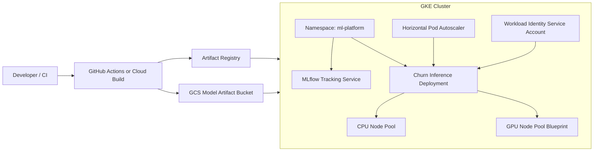

# GKE ML Platform Blueprint

This project is a cloud-native ML platform blueprint for GCP. It is intentionally
structured like a real platform repository: Terraform for infrastructure,
Kubernetes manifests for runtime workloads, and GitOps-friendly deployment
files.

## Interview Value

This project demonstrates the platform engineering side of MLOps:

- How to design a GKE-based ML platform
- How MLflow, model artifacts, and inference services fit together
- How to use HPA for inference autoscaling
- How to plan GPU node pools for training or serving workloads
- How GitOps can promote ML workloads across environments

## Architecture



## Contents

```text
terraform/
  main.tf
  variables.tf
  outputs.tf
k8s/
  namespace.yaml
  mlflow-deployment.yaml
  inference-deployment.yaml
  inference-hpa.yaml
gitops/
  application.yaml
```

## How To Use

Initialize Terraform:

```bash
terraform -chdir=terraform init
```

Plan:

```bash
terraform -chdir=terraform plan \
  -var="project_id=YOUR_PROJECT_ID" \
  -var="region=us-central1"
```

Apply Kubernetes manifests after the cluster exists:

```bash
kubectl apply -f k8s/
```

## Talking Points

- I separated infrastructure provisioning from workload deployment.
- I used labels and namespaces to support multi-team platform ownership.
- I modeled the inference service as a scalable Kubernetes workload.
- I included a GPU node pool blueprint for ML-specific scheduling needs.
- I kept the project GitOps-compatible for promotion across environments.

## Interview Architecture

Explain this as the foundation layer of an ML platform. Terraform provisions
GCP primitives, GKE hosts the runtime, GCS stores model artifacts, MLflow tracks
experiments, and Kubernetes manifests define serving workloads. GitOps can sit
on top to keep cluster state reconciled from Git.

## Interview Flow

1. A platform engineer provisions GKE, node pools, artifact storage, and IAM
   with Terraform.
2. ML teams publish model artifacts to GCS and track experiments in MLflow.
3. CI/CD builds an inference image and updates Kubernetes manifests.
4. GitOps or `kubectl` applies the inference deployment and HPA.
5. GKE scales the service based on load, while the platform team monitors
   latency, errors, resource usage, and rollout health.
