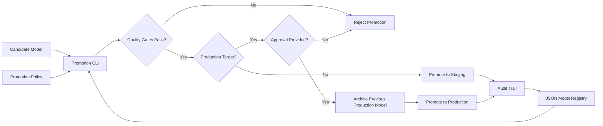

# Model Promotion Gates

This project simulates an MLflow-style model registry promotion workflow. It is
small enough to explain in an interview and practical enough to show real MLOps
thinking: quality gates, approval gates, lineage, and audit-friendly state.

## What It Demonstrates

- Candidate-to-staging and staging-to-production model promotion
- Metrics-based promotion gates
- Approval requirement for production
- JSON model registry with audit trail
- CI-friendly Python tests

## Architecture



## Flow

1. The CLI loads a model candidate from the JSON registry.
2. Promotion policy checks accuracy, p99 latency, and error rate.
3. Staging promotion is automatic when gates pass.
4. Production promotion requires explicit approval.
5. Previous production models are archived and the audit trail is updated.

## Promotion Rules

Default gates:

- Accuracy must be at least `0.82`
- p99 latency must be at most `250 ms`
- Error rate must be at most `0.02`
- Production promotion requires approval

## Testing and Security Gates

- **Code and unit tests:** validate Python CLIs, policy logic, API handlers, and
  reusable ML utilities with `pytest` before merge.
- **Data and ML tests:** run schema checks, feature freshness checks, drift
  checks, model evaluation, and batch/streaming quality gates with pandas,
  Great Expectations, Evidently, and Vertex AI evaluation metadata.
- **Pipeline tests:** validate Kubeflow/Vertex AI pipeline components,
  container inputs/outputs, retry policy, artifact paths, and promotion evidence
  before production execution.
- **LLM and RAG tests:** evaluate prompt injection, PII leakage, groundedness,
  hallucination, toxicity, retrieval quality, token budget, and agent loop
  limits with Model Armor, Vertex AI Gen AI evaluation, Ragas, or DeepEval.
- **CI/CD security:** scan Terraform, Kubernetes manifests, dependencies, and
  container images using Prisma Cloud, Artifact Analysis, and policy-as-code;
  sign approved images with Cosign.
- **Admission and runtime security:** enforce Binary Authorization, Kubernetes
  network policies, Secret Manager/External Secrets, VPC Service Controls, and
  SentinelOne or Prisma Cloud runtime workload protection on GKE.
- **Release safety:** use canary, shadow, performance, chaos, and rollback tests
  with Cloud Deploy, Cloud Monitoring, OpenTelemetry, Eventarc, and Pub/Sub
  remediation workflows.

## Run

Evaluate a model for staging:

```bash
python3 src/promotion_cli.py evaluate \
  --registry examples/registry.json \
  --model-id churn-model-v3 \
  --target staging
```

Promote to staging:

```bash
python3 src/promotion_cli.py promote \
  --registry examples/registry.json \
  --model-id churn-model-v3 \
  --target staging
```

Promote to production with approval:

```bash
python3 src/promotion_cli.py promote \
  --registry examples/registry.json \
  --model-id churn-model-v3 \
  --target production \
  --approved-by platform-lead
```

## Interview Talking Points

- This mirrors MLflow model registry promotion patterns.
- Promotion is automated, but production still requires human approval.
- Metrics gates prevent models with high latency or weak quality from shipping.
- The audit trail supports governance and rollback discussions.

## Interview Architecture

Explain this as the model-release control layer. A registry stores model state
and lineage, a promotion policy defines quality requirements, and a CLI or CI
job decides whether a model can move from candidate to staging or production.

## Interview Flow

1. A training pipeline writes a candidate model and metrics to the registry.
2. The promotion gate loads model metrics and the target environment.
3. Accuracy, latency, and error-rate checks are evaluated.
4. Staging promotion can be automatic when gates pass.
5. Production promotion requires approval, archives the previous production
   model, and records an audit event.
