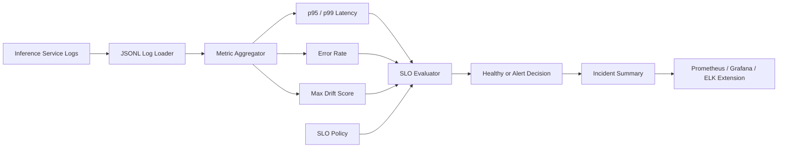

# ML Observability SRE

This project is a small ML SRE toolkit for inference services. It analyzes
JSONL inference logs and produces practical SLO signals: p95/p99 latency, error
rate, drift score, and alert decisions.

## What It Demonstrates

- Production inference monitoring concepts
- SLO-oriented reporting
- p99 latency tracking
- Drift and error-rate signals
- Incident-summary style output
- Python automation for operational workflows

## Architecture



## Flow

1. Inference logs are parsed from JSONL.
2. The tool calculates latency percentiles, error rate, and drift score.
3. SLO policy thresholds are evaluated against those metrics.
4. The output summarizes whether the service is healthy or alerting.

## Run

```bash
python3 src/ml_sre_report.py --logs examples/inference_logs.jsonl
```

Example output:

```json
{
  "status": "alert",
  "summary": "SLO breach: p99 latency or error rate exceeded threshold",
  "metrics": {
    "requests": 20,
    "p95_latency_ms": 310,
    "p99_latency_ms": 480,
    "error_rate": 0.05,
    "max_drift_score": 0.22
  }
}
```

## Interview Talking Points

- ML services need standard SRE signals plus ML-specific signals like drift.
- p99 latency matters more than average latency for real-time inference.
- Alert rules should combine reliability and ML quality indicators.
- This can be extended into Prometheus, Grafana, OpenTelemetry, or ELK.

## Interview Architecture

Explain this as the SRE layer for ML serving. Inference logs are the source of
truth, metric aggregation turns logs into reliability and model-quality signals,
and an SLO evaluator decides whether the service is healthy or alerting.

## Interview Flow

1. The inference service emits structured logs for every prediction.
2. A monitoring job parses latency, status, and drift fields.
3. The tool calculates p95, p99, error rate, request count, and max drift.
4. SLO policy checks compare observed values against thresholds.
5. The output becomes an incident summary for Prometheus, Grafana, PagerDuty,
   Slack, or a platform runbook.
