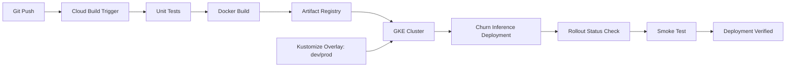
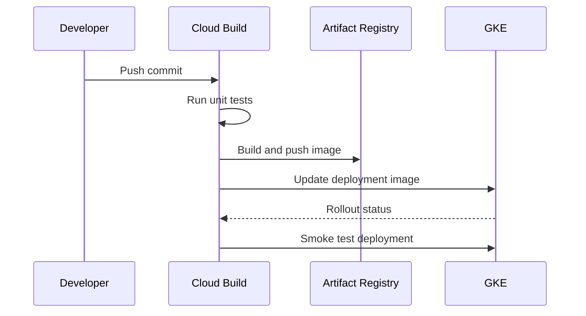

# Cloud Build GKE ML CI/CD

This project shows a production-style CI/CD path for ML inference services on
GCP. It uses Cloud Build to test, build, push, and deploy a containerized model
serving API to GKE.

## What It Demonstrates

- Cloud Build pipeline design
- Artifact Registry image publishing
- GKE deployment rollout
- Kustomize overlays for environment promotion
- Smoke-test stage after deployment
- Clear separation of build, deploy, and verify stages

## Architecture



## Pipeline Flow



## Files

```text
cloudbuild.yaml
service/
  Dockerfile
  app.py
k8s/base/
k8s/overlays/dev/
k8s/overlays/prod/
terraform/
```

## Testing and Security Gates

- **Code and unit tests:** validate Python CLIs, policy logic, API handlers, and
  reusable ML utilities with `pytest` before merge.
- **Data and ML tests:** run schema checks, feature freshness checks, drift
  checks, model evaluation, and batch/streaming quality gates with pandas,
  Great Expectations, Evidently, and Vertex AI evaluation metadata.
- **Pipeline tests:** validate Kubeflow/Vertex AI pipeline components,
  container inputs/outputs, retry policy, artifact paths, and promotion evidence
  before production execution.
- **LLM and RAG tests:** evaluate prompt injection, PII leakage, groundedness,
  hallucination, toxicity, retrieval quality, token budget, and agent loop
  limits with Model Armor, Vertex AI Gen AI evaluation, Ragas, or DeepEval.
- **CI/CD security:** scan Terraform, Kubernetes manifests, dependencies, and
  container images using Prisma Cloud, Artifact Analysis, and policy-as-code;
  sign approved images with Cosign.
- **Admission and runtime security:** enforce Binary Authorization, Kubernetes
  network policies, Secret Manager/External Secrets, VPC Service Controls, and
  SentinelOne or Prisma Cloud runtime workload protection on GKE.
- **Release safety:** use canary, shadow, performance, chaos, and rollback tests
  with Cloud Deploy, Cloud Monitoring, OpenTelemetry, Eventarc, and Pub/Sub
  remediation workflows.

## Interview Talking Points

- This maps DevOps CI/CD knowledge into ML serving.
- The pipeline can be extended with model validation gates before deployment.
- Kustomize overlays mirror real environment promotion patterns.
- Smoke tests reduce failed rollout risk.
- Artifact Registry and GKE are native GCP choices for ML platform delivery.

## Interview Architecture

Explain this as the delivery layer for ML inference. Cloud Build owns test,
build, push, deploy, and smoke-test stages; Artifact Registry stores immutable
images; Kustomize manages environment differences; GKE runs the service.

## Interview Flow

1. A developer changes serving code, model packaging, or deployment config.
2. Cloud Build runs tests and builds a Docker image.
3. The image is pushed to Artifact Registry with a versioned tag.
4. Kustomize overlays select dev or prod deployment settings.
5. GKE rolls out the new image, Cloud Build checks rollout status, and a smoke
   test confirms the endpoint can serve predictions.
