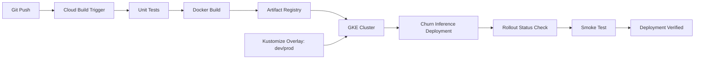
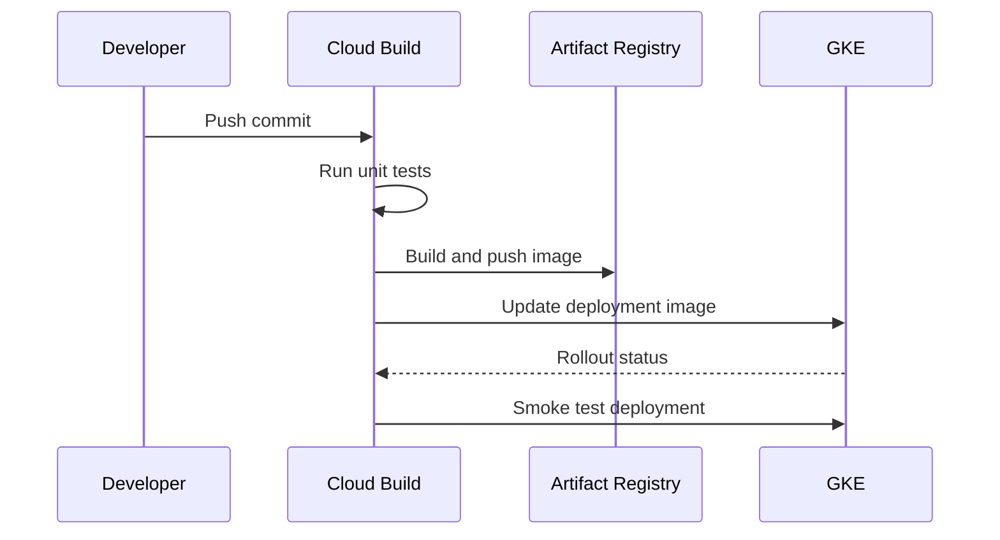

# Cloud Build GKE ML CI/CD

This project shows a production-style CI/CD path for ML inference services on
GCP. It uses Cloud Build to test, build, push, and deploy a containerized model
serving API to GKE.

## What It Demonstrates

- Cloud Build pipeline design
- Artifact Registry image publishing
- GKE deployment rollout
- Kustomize overlays for environment promotion
- Smoke-test stage after deployment
- Clear separation of build, deploy, and verify stages

## Architecture



## Pipeline Flow



## Files

```text
cloudbuild.yaml
service/
  Dockerfile
  app.py
k8s/base/
k8s/overlays/dev/
k8s/overlays/prod/
terraform/
```

## Interview Talking Points

- This maps DevOps CI/CD knowledge into ML serving.
- The pipeline can be extended with model validation gates before deployment.
- Kustomize overlays mirror real environment promotion patterns.
- Smoke tests reduce failed rollout risk.
- Artifact Registry and GKE are native GCP choices for ML platform delivery.
