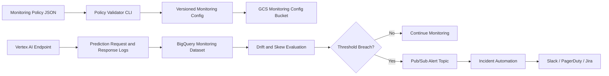

# Vertex AI Monitoring Blueprint

This project demonstrates how to reason about managed ML monitoring on GCP
using Vertex AI Model Monitoring concepts. It is designed as a blueprint and
local validator so you can explain monitoring design without needing to deploy
expensive online prediction infrastructure during an interview.

## What It Demonstrates

- Vertex AI endpoint monitoring design
- Feature drift and prediction drift thresholds
- BigQuery logging sink for prediction analytics
- Pub/Sub alert routing for MLOps/SRE workflows
- Terraform foundation for monitoring data stores
- Python validation of monitoring policy configs

## Architecture



## Run Policy Validation

```bash
python3 src/monitoring_policy.py validate \
  --policy examples/model_monitoring_policy.json
```

## Interview Talking Points

- I know when to use managed Vertex AI monitoring versus custom Prometheus.
- Drift thresholds should be explicit, reviewed, and version controlled.
- Monitoring signals should route to an incident workflow, not sit in a UI.
- BigQuery gives a scalable audit trail for prediction logs and analysis.
