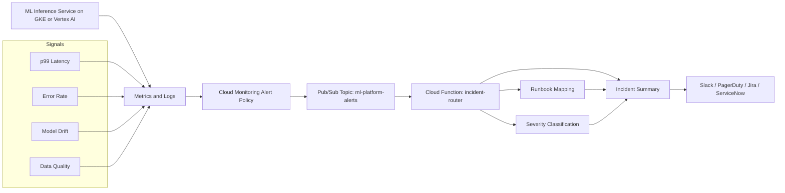

# Pub/Sub ML Incident Automation

This project demonstrates how ML platform alerts can be routed into automated
incident triage workflows on GCP. It uses Pub/Sub-style alert payloads and a
Cloud Function-compatible Python handler.

## Architecture



## Flow

1. ML inference workloads emit platform and model-quality signals.
2. Cloud Monitoring evaluates alert policies for latency, errors, drift, and
   data quality.
3. Alerts are published to a Pub/Sub topic.
4. A Cloud Function-style router parses the alert payload.
5. The router maps the alert to an owner, severity, runbook, and recommended
   actions.
6. The generated incident summary can be sent to Slack, PagerDuty, Jira, or
   ServiceNow.

## What It Demonstrates

- Pub/Sub alert routing for ML incidents
- Cloud Function style event handler
- Runbook mapping by alert type
- Severity classification
- Incident response summary generation
- Terraform foundation for alert topics

## Example Alerts

- High inference p99 latency
- High inference error rate
- Model drift detected
- Prediction data quality issue

## Testing and Security Gates

- **Code and unit tests:** validate Python CLIs, policy logic, API handlers, and
  reusable ML utilities with `pytest` before merge.
- **Data and ML tests:** run schema checks, feature freshness checks, drift
  checks, model evaluation, and batch/streaming quality gates with pandas,
  Great Expectations, Evidently, and Vertex AI evaluation metadata.
- **Pipeline tests:** validate Kubeflow/Vertex AI pipeline components,
  container inputs/outputs, retry policy, artifact paths, and promotion evidence
  before production execution.
- **LLM and RAG tests:** evaluate prompt injection, PII leakage, groundedness,
  hallucination, toxicity, retrieval quality, token budget, and agent loop
  limits with Model Armor, Vertex AI Gen AI evaluation, Ragas, or DeepEval.
- **CI/CD security:** scan Terraform, Kubernetes manifests, dependencies, and
  container images using Prisma Cloud, Artifact Analysis, and policy-as-code;
  sign approved images with Cosign.
- **Admission and runtime security:** enforce Binary Authorization, Kubernetes
  network policies, Secret Manager/External Secrets, VPC Service Controls, and
  SentinelOne or Prisma Cloud runtime workload protection on GKE.
- **Release safety:** use canary, shadow, performance, chaos, and rollback tests
  with Cloud Deploy, Cloud Monitoring, OpenTelemetry, Eventarc, and Pub/Sub
  remediation workflows.

## Run Locally

```bash
python3 src/incident_router.py \
  --alert examples/model_drift_alert.json \
  --runbooks config/runbooks.json
```

## Interview Talking Points

- Monitoring is only useful when it triggers actionable workflows.
- ML incidents need both platform and model-quality runbooks.
- Pub/Sub decouples alert producers from incident response consumers.
- This can be extended to Slack, PagerDuty, Jira, or ServiceNow.

## Interview Architecture

Explain this as the operations bridge between monitoring and response. Cloud
Monitoring produces alerts, Pub/Sub decouples producers from responders, and a
Cloud Function-style router maps each alert to severity, owner, runbook, and
recommended action.

## Interview Flow

1. A serving system emits latency, error, drift, or data-quality signals.
2. Cloud Monitoring evaluates alert policies and publishes events to Pub/Sub.
3. The incident router parses the alert payload.
4. The router maps alert type to owner, severity, runbook, and next action.
5. The incident summary can be sent to Slack, PagerDuty, Jira, ServiceNow, or a
   custom remediation workflow.
