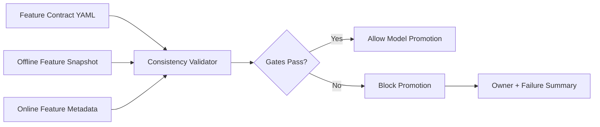

# Feature Store Consistency Guardrails

This project models the controls a senior MLOps/platform engineer would add
around feature store usage: schema contracts, freshness checks, offline/online
parity, and deployment gates before a model is promoted.

The goal is not to replace a managed feature store. The goal is to demonstrate
how to prevent a common production failure mode: training on one feature shape
and serving with another.

## What It Demonstrates

- Feature contract validation for training and serving
- Offline/online schema parity checks
- Freshness SLA validation
- Feature owner metadata
- CI-friendly quality gates
- Clear failure output for platform teams

## Architecture



## Run

```bash
python3 src/feature_consistency.py validate \
  --contract examples/feature_contract.json \
  --offline examples/offline_snapshot.json \
  --online examples/online_metadata.json
```

## Interview Talking Points

- Training/serving skew is a platform risk, not only a modeling issue.
- Feature contracts make ownership, type expectations, and freshness explicit.
- CI gates should fail before a model reaches production traffic.
- The same pattern can be implemented with Feast, Vertex AI Feature Store,
  BigQuery, Redis, or custom online stores.
