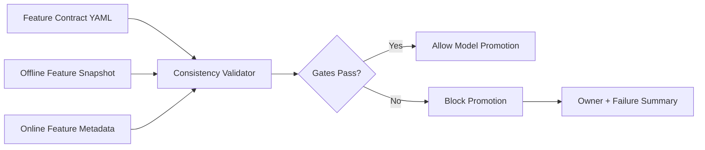

# Feature Store Consistency Guardrails

This project models the controls a senior MLOps/platform engineer would add
around feature store usage: schema contracts, freshness checks, offline/online
parity, and deployment gates before a model is promoted.

The goal is not to replace a managed feature store. The goal is to demonstrate
how to prevent a common production failure mode: training on one feature shape
and serving with another.

## What It Demonstrates

- Feature contract validation for training and serving
- Offline/online schema parity checks
- Freshness SLA validation
- Feature owner metadata
- CI-friendly quality gates
- Clear failure output for platform teams

## Architecture



## Testing and Security Gates

- **Code and unit tests:** validate Python CLIs, policy logic, API handlers, and
  reusable ML utilities with `pytest` before merge.
- **Data and ML tests:** run schema checks, feature freshness checks, drift
  checks, model evaluation, and batch/streaming quality gates with pandas,
  Great Expectations, Evidently, and Vertex AI evaluation metadata.
- **Pipeline tests:** validate Kubeflow/Vertex AI pipeline components,
  container inputs/outputs, retry policy, artifact paths, and promotion evidence
  before production execution.
- **LLM and RAG tests:** evaluate prompt injection, PII leakage, groundedness,
  hallucination, toxicity, retrieval quality, token budget, and agent loop
  limits with Model Armor, Vertex AI Gen AI evaluation, Ragas, or DeepEval.
- **CI/CD security:** scan Terraform, Kubernetes manifests, dependencies, and
  container images using Prisma Cloud, Artifact Analysis, and policy-as-code;
  sign approved images with Cosign.
- **Admission and runtime security:** enforce Binary Authorization, Kubernetes
  network policies, Secret Manager/External Secrets, VPC Service Controls, and
  SentinelOne or Prisma Cloud runtime workload protection on GKE.
- **Release safety:** use canary, shadow, performance, chaos, and rollback tests
  with Cloud Deploy, Cloud Monitoring, OpenTelemetry, Eventarc, and Pub/Sub
  remediation workflows.

## Run

```bash
python3 src/feature_consistency.py validate \
  --contract examples/feature_contract.json \
  --offline examples/offline_snapshot.json \
  --online examples/online_metadata.json
```

## Interview Talking Points

- Training/serving skew is a platform risk, not only a modeling issue.
- Feature contracts make ownership, type expectations, and freshness explicit.
- CI gates should fail before a model reaches production traffic.
- The same pattern can be implemented with Feast, Vertex AI Feature Store,
  BigQuery, Redis, or custom online stores.

## Interview Architecture

Explain this as the feature reliability gate before model promotion. A feature
contract defines the expected entity, schema, nullability, owner, and freshness
SLA. Offline training snapshots and online feature metadata are compared before
the model can move forward.

## Interview Flow

1. A data or ML team updates a feature contract.
2. The training pipeline produces an offline feature snapshot.
3. The online store publishes schema and freshness metadata.
4. The validator checks entity presence, dtype parity, null rates, and freshness.
5. Passing gates allow promotion; failures block release and point to the owning
   team.
