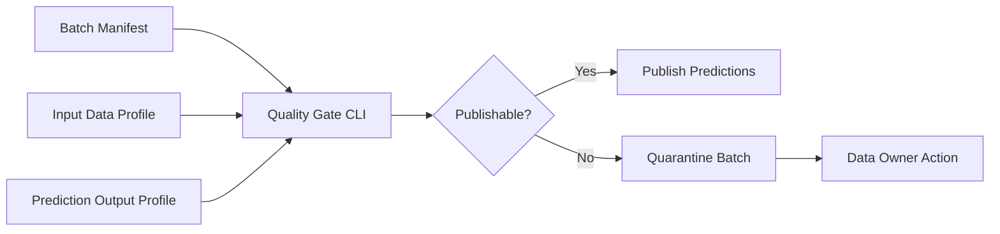

# Batch Inference Quality Gates

This project demonstrates a production-style batch inference control plane:
validate input data, estimate scoring risk, enforce output completeness, and
produce an audit summary before results are published downstream.

It is intentionally lightweight so it can run locally, but the design maps to
Airflow, Cloud Composer, Vertex AI Batch Prediction, BigQuery, GCS, and dbt.

## What It Demonstrates

- Data quality gates before scoring
- Batch prediction manifest validation
- Output completeness checks
- Risk-based publish or quarantine decisions
- Audit-friendly JSON summaries
- CI-friendly tests around pipeline policy

## Architecture



## Run

```bash
python3 src/batch_quality_gate.py evaluate \
  --manifest examples/batch_manifest.json
```

## Interview Talking Points

- Batch ML is still production software and needs release gates.
- Input row count, missing values, duplicate keys, and output completeness are
  operational signals.
- Quarantine paths are safer than silently publishing bad predictions.
- The same policy can be plugged into Cloud Composer, Vertex AI pipelines, or
  scheduled Cloud Run jobs.

## Interview Architecture

Explain this as the release gate for scheduled batch scoring. A manifest
captures input profile, prediction profile, and policy thresholds. The gate
decides whether the batch can be published or must be quarantined.

## Interview Flow

1. A batch job reads input data and computes an input profile.
2. The model scores records and writes a prediction output profile.
3. A manifest combines row counts, duplicate rates, missing features, null
   predictions, and failed prediction rates.
4. The quality gate compares the manifest against policy.
5. Valid batches are published; risky batches are quarantined with an audit
   summary for the owning team.
