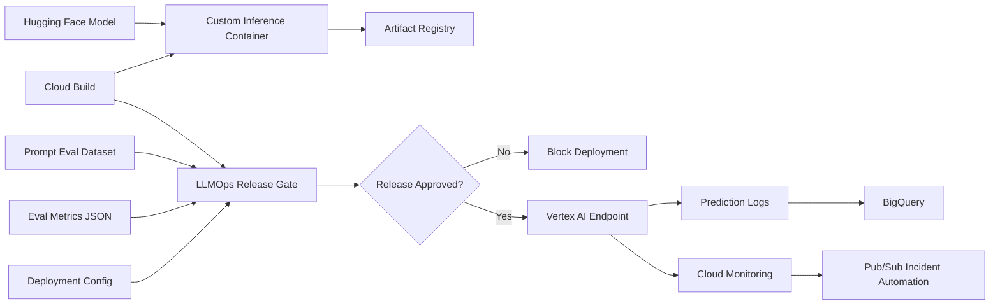
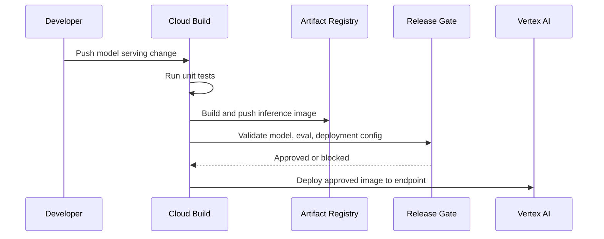

# Vertex AI Hugging Face LLMOps Blueprint

This project demonstrates how to operate a Hugging Face model on Vertex AI with
production MLOps controls around model metadata, deployment configuration,
evaluation gates, safety policy, and rollout readiness.

It is designed as a local blueprint: you can validate the release policy and
explain the cloud architecture without needing to run GPU infrastructure during
an interview. The same pattern maps to Vertex AI custom containers, Hugging Face
Transformers, Cloud Build, Artifact Registry, Cloud Storage, BigQuery, and
Cloud Monitoring.

## What It Demonstrates

- Hugging Face model metadata review before deployment
- Vertex AI endpoint deployment planning
- LLM evaluation gates for quality, latency, cost, and safety
- Prompt evaluation dataset ownership
- Artifact Registry image promotion
- BigQuery inference logging design
- Cloud Monitoring alert routing
- CI-friendly release readiness validation

## Architecture



## Project Layout

```text
cloudbuild.yaml
examples/
  deployment_config.json
  evaluation_report.json
  model_card.json
  prompt_eval_set.json
service/
  app.py
  Dockerfile
  requirements.txt
  tests/
src/
  llmops_release_gate.py
terraform/
  main.tf
  variables.tf
  outputs.tf
tests/
  test_llmops_release_gate.py
```

## Release Gates

The local validator blocks deployment when:

- Model metadata is missing license, owner, task, or approved source
- Evaluation quality is below threshold
- Toxicity, hallucination, or PII rates exceed policy
- p95 latency is above the serving target
- Estimated cost per 1,000 predictions is too high
- Deployment config is missing logging, monitoring, or rollback settings

## Testing and Security Gates

- **Code and unit tests:** validate Python CLIs, policy logic, API handlers, and
  reusable ML utilities with `pytest` before merge.
- **Data and ML tests:** run schema checks, feature freshness checks, drift
  checks, model evaluation, and batch/streaming quality gates with pandas,
  Great Expectations, Evidently, and Vertex AI evaluation metadata.
- **Pipeline tests:** validate Kubeflow/Vertex AI pipeline components,
  container inputs/outputs, retry policy, artifact paths, and promotion evidence
  before production execution.
- **LLM and RAG tests:** evaluate prompt injection, PII leakage, groundedness,
  hallucination, toxicity, retrieval quality, token budget, and agent loop
  limits with Model Armor, Vertex AI Gen AI evaluation, Ragas, or DeepEval.
- **CI/CD security:** scan Terraform, Kubernetes manifests, dependencies, and
  container images using Prisma Cloud, Artifact Analysis, and policy-as-code;
  sign approved images with Cosign.
- **Admission and runtime security:** enforce Binary Authorization, Kubernetes
  network policies, Secret Manager/External Secrets, VPC Service Controls, and
  SentinelOne or Prisma Cloud runtime workload protection on GKE.
- **Release safety:** use canary, shadow, performance, chaos, and rollback tests
  with Cloud Deploy, Cloud Monitoring, OpenTelemetry, Eventarc, and Pub/Sub
  remediation workflows.

## Run

```bash
python3 src/llmops_release_gate.py evaluate \
  --model-card examples/model_card.json \
  --eval-report examples/evaluation_report.json \
  --deployment-config examples/deployment_config.json
```

Expected result:

```json
{
  "status": "approved",
  "model": "distilbert-base-uncased-finetuned-sst-2-english",
  "target": "vertex-ai-endpoint",
  "failures": []
}
```

## Cloud Build Flow



## Interview Talking Points

- Hugging Face gives model velocity; Vertex AI gives managed deployment,
  governance, logging, monitoring, and scalable serving.
- LLMOps release gates should combine model quality, safety, latency, cost,
  ownership, and rollback readiness.
- Evaluation data should be versioned and owned like application test data.
- Custom containers let platform teams standardize observability, auth, and
  rollout behavior around open-source models.
- This pattern can be extended to Vertex AI Pipelines, Model Registry,
  Experiments, Feature Store, and Cloud Deploy.

## Interview Architecture

Explain this as a controlled path for open-source models on managed GCP
serving. Hugging Face supplies the model, a custom container standardizes the
runtime, Cloud Build creates the artifact, Artifact Registry stores it, and
Vertex AI serves it behind release gates.

## Interview Flow

1. A model card describes source, task, owner, license, and production approval.
2. Evaluation jobs produce quality, safety, latency, and cost metrics.
3. Deployment config defines Vertex AI endpoint, traffic split, logging,
   monitoring, and rollback.
4. The release gate validates all three inputs.
5. Approved releases deploy gradually to Vertex AI while prediction logs and
   alerts feed monitoring workflows.
