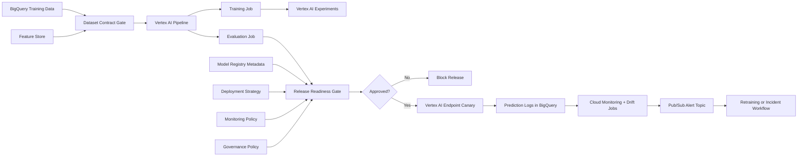

# Vertex AI MLOps Control Plane

This project is a 10-years-experience style MLOps blueprint for operating
machine learning models on GCP. It focuses on the full ML lifecycle: dataset
contracts, training pipelines, experiment lineage, model registry promotion,
canary deployment, monitoring, retraining triggers, and governance.

The project is intentionally local-first. The release readiness validator can be
run without cloud spend, while the architecture maps directly to Vertex AI
Pipelines, Vertex AI Experiments, Vertex AI Model Registry, Feature Store,
BigQuery, Cloud Build, Artifact Registry, Cloud Monitoring, and Pub/Sub.

## What It Demonstrates

- End-to-end ML release governance, not only model serving
- Dataset contract and feature freshness checks
- Training pipeline reproducibility policy
- Experiment and model lineage requirements
- Model registry approval workflow
- Canary rollout strategy with rollback readiness
- Drift, skew, data quality, and performance monitoring
- Retraining trigger policy
- Compliance-oriented audit summary

## Architecture



## Project Layout

```text
examples/
  ml_release_candidate.json
  failed_release_candidate.json
pipelines/
  vertex_pipeline_spec.yaml
src/
  release_readiness.py
terraform/
  main.tf
  variables.tf
  outputs.tf
tests/
  test_release_readiness.py
```

## Release Readiness Gates

The validator blocks a release when:

- Dataset contract is missing ownership, schema version, or freshness evidence
- Training pipeline is not reproducible
- Experiment lineage is incomplete
- Offline metrics do not pass business thresholds
- Fairness or calibration checks fail
- Model registry state is not approved
- Canary traffic starts too high
- Rollback configuration is missing
- Monitoring does not include drift, skew, data quality, latency, and error rate
- Retraining triggers are not defined
- Audit owner or approval evidence is missing

## Run

```bash
python3 src/release_readiness.py evaluate \
  --candidate examples/ml_release_candidate.json
```

Expected output:

```json
{
  "status": "approved",
  "model_name": "customer_churn_xgboost",
  "version": "2026-05-31.1",
  "target_environment": "production",
  "failures": []
}
```

## Interview Talking Points

- Senior MLOps is about controlling the whole ML lifecycle, not just deploying
  a Docker image.
- Vertex AI gives managed building blocks, but platform teams still need release
  policy, ownership, rollback paths, and auditability.
- Model quality gates should include ML metrics, product impact metrics,
  fairness checks, calibration, and operational readiness.
- Monitoring must feed both incident response and retraining workflows.
- A mature ML platform makes the safe path the easiest path for data scientists.
