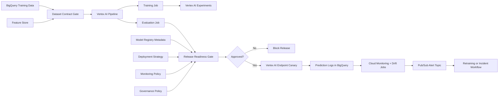

# Vertex AI MLOps Control Plane

This project is a 10-years-experience style MLOps blueprint for operating
machine learning models on GCP. It focuses on the full ML lifecycle: dataset
contracts, training pipelines, experiment lineage, model registry promotion,
canary deployment, monitoring, retraining triggers, and governance.

The project is intentionally local-first. The release readiness validator can be
run without cloud spend, while the architecture maps directly to Vertex AI
Pipelines, Vertex AI Experiments, Vertex AI Model Registry, Feature Store,
BigQuery, Cloud Build, Artifact Registry, Cloud Monitoring, and Pub/Sub.

## What It Demonstrates

- End-to-end ML release governance, not only model serving
- Dataset contract and feature freshness checks
- Training pipeline reproducibility policy
- Experiment and model lineage requirements
- Model registry approval workflow
- Canary rollout strategy with rollback readiness
- Drift, skew, data quality, and performance monitoring
- Retraining trigger policy
- Compliance-oriented audit summary

## Architecture



## Project Layout

```text
examples/
  ml_release_candidate.json
  failed_release_candidate.json
pipelines/
  vertex_pipeline_spec.yaml
src/
  release_readiness.py
terraform/
  main.tf
  variables.tf
  outputs.tf
tests/
  test_release_readiness.py
```

## Release Readiness Gates

The validator blocks a release when:

- Dataset contract is missing ownership, schema version, or freshness evidence
- Training pipeline is not reproducible
- Experiment lineage is incomplete
- Offline metrics do not pass business thresholds
- Fairness or calibration checks fail
- Model registry state is not approved
- Canary traffic starts too high
- Rollback configuration is missing
- Monitoring does not include drift, skew, data quality, latency, and error rate
- Retraining triggers are not defined
- Audit owner or approval evidence is missing

## Testing and Security Gates

- **Code and unit tests:** validate Python CLIs, policy logic, API handlers, and
  reusable ML utilities with `pytest` before merge.
- **Data and ML tests:** run schema checks, feature freshness checks, drift
  checks, model evaluation, and batch/streaming quality gates with pandas,
  Great Expectations, Evidently, and Vertex AI evaluation metadata.
- **Pipeline tests:** validate Kubeflow/Vertex AI pipeline components,
  container inputs/outputs, retry policy, artifact paths, and promotion evidence
  before production execution.
- **LLM and RAG tests:** evaluate prompt injection, PII leakage, groundedness,
  hallucination, toxicity, retrieval quality, token budget, and agent loop
  limits with Model Armor, Vertex AI Gen AI evaluation, Ragas, or DeepEval.
- **CI/CD security:** scan Terraform, Kubernetes manifests, dependencies, and
  container images using Prisma Cloud, Artifact Analysis, and policy-as-code;
  sign approved images with Cosign.
- **Admission and runtime security:** enforce Binary Authorization, Kubernetes
  network policies, Secret Manager/External Secrets, VPC Service Controls, and
  SentinelOne or Prisma Cloud runtime workload protection on GKE.
- **Release safety:** use canary, shadow, performance, chaos, and rollback tests
  with Cloud Deploy, Cloud Monitoring, OpenTelemetry, Eventarc, and Pub/Sub
  remediation workflows.

## Run

```bash
python3 src/release_readiness.py evaluate \
  --candidate examples/ml_release_candidate.json
```

Expected output:

```json
{
  "status": "approved",
  "model_name": "customer_churn_xgboost",
  "version": "2026-05-31.1",
  "target_environment": "production",
  "failures": []
}
```

## Interview Talking Points

- Senior MLOps is about controlling the whole ML lifecycle, not just deploying
  a Docker image.
- Vertex AI gives managed building blocks, but platform teams still need release
  policy, ownership, rollback paths, and auditability.
- Model quality gates should include ML metrics, product impact metrics,
  fairness checks, calibration, and operational readiness.
- Monitoring must feed both incident response and retraining workflows.
- A mature ML platform makes the safe path the easiest path for data scientists.

## Interview Architecture

Explain this as the control plane over Vertex AI. BigQuery and Feature Store
provide data, Vertex AI Pipelines trains and evaluates, Experiments and Metadata
record lineage, Model Registry owns approval, and endpoint deployment is gated
by canary, monitoring, retraining, and governance policies.

## Interview Flow

1. Dataset contracts and feature freshness checks validate training readiness.
2. Vertex AI Pipelines runs reproducible training and evaluation.
3. Experiments and Metadata capture lineage from data snapshot to model artifact.
4. The release readiness gate checks quality, fairness, calibration, registry
   approval, monitoring, rollback, and audit metadata.
5. Approved models deploy as canaries; monitoring feeds incident response and
   retraining triggers.
