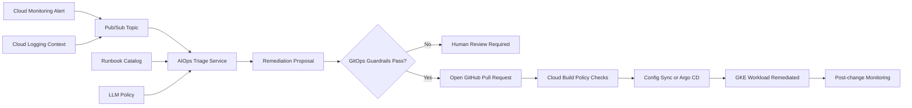

# GCP LLM AIOps GitOps Remediation

This project demonstrates a senior platform/MLOps pattern: using LLM-assisted
AIOps to triage production incidents, generate remediation proposals, and route
safe changes through GitOps instead of making direct production mutations.

The design is local-first and cloud-ready. The Python validator can run without
GCP access, while the architecture maps to Cloud Monitoring, Cloud Logging,
Pub/Sub, Cloud Run or Cloud Functions, Vertex AI Gemini, GKE, Config Sync or
Argo CD, Cloud Build, Artifact Registry, and GitHub pull requests.

## What It Demonstrates

- LLM-assisted incident triage without uncontrolled auto-remediation
- Cloud Monitoring alert and log context summarization
- Runbook matching by service, symptom, and severity
- GitOps pull request proposal generation
- Guardrails for blast radius, approval, rollback, and policy checks
- Human-in-the-loop production remediation
- GKE deployment and HPA remediation examples
- Audit-friendly incident and change summaries

## Architecture



## Project Layout

```text
examples/
  alert_payload.json
  runbook_catalog.json
  unsafe_alert_payload.json
gitops/
  overlays/prod/inference-hpa.yaml
src/
  aiops_gitops.py
terraform/
  main.tf
  variables.tf
  outputs.tf
tests/
  test_aiops_gitops.py
```

## Guardrail Model

The validator approves a GitOps remediation proposal only when:

- The alert maps to a known runbook
- The severity is allowed for assisted remediation
- The runbook supports the proposed action
- The change uses GitOps, not direct cluster mutation
- Rollback instructions are present
- Blast radius is limited to one service
- Production changes require approval
- The proposed manifest path is inside an allowed GitOps directory

## Run

```bash
python3 src/aiops_gitops.py propose \
  --alert examples/alert_payload.json \
  --runbooks examples/runbook_catalog.json
```

Expected result:

```json
{
  "status": "gitops_pr_ready",
  "service": "churn-inference",
  "recommended_action": "increase_hpa_max_replicas",
  "requires_human_approval": true,
  "failures": []
}
```

## Interview Talking Points

- AIOps should reduce diagnosis time, not bypass production safety.
- LLMs are useful for summarization, runbook matching, and proposal generation,
  but GitOps should remain the control plane for production changes.
- Human approval, rollback, policy checks, and audit trails are non-negotiable
  for production remediation.
- This pattern can be extended with Vertex AI Gemini, Cloud Deploy, Policy
  Controller, Config Sync, Argo CD, Slack, PagerDuty, Jira, and ServiceNow.
