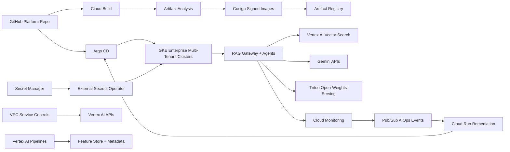

# AegisSphere

Autonomous self-healing Generative AI and agentic platform on GKE Enterprise.

AegisSphere is a mission-critical AI Platform-as-a-Service for real-time RAG
pipelines and autonomous GenAI agents. It is designed around four explicit
operating pillars: DevOps/GitOps, DevSecOps, MLOps/LLMOps, and AIOps. The
platform runs on GKE Enterprise, uses Terraform and Argo CD for delivery,
protects the software supply chain with Cloud Build, Artifact Analysis, Cosign,
Secret Manager, External Secrets, and VPC Service Controls, and closes the loop
with autonomous remediation for latency, token budget, vulnerability, and
hallucination anomalies.

## Pillar 1: DevOps and GitOps

- Terraform modules provision multi-tenant GKE clusters, VPC peering, Cloud SQL,
  IAM, Artifact Registry, Secret Manager, and Pub/Sub resources.
- Argo CD continuously reconciles applications, model endpoints, Triton
  inference servers, vector services, and network policies from Git.
- Config Connector can manage selected GCP resources through Kubernetes CRDs.
- Tenant sandboxes are represented as namespaces, IAM bindings, policies, and
  model-serving manifests.

## Pillar 2: DevSecOps

- Cloud Build creates immutable containers for FastAPI gateways, vector workers,
  Triton model servers, and fine-tuning jobs.
- Images are scanned by Artifact Analysis and signed with Cosign before
  promotion.
- VPC Service Controls create a perimeter around Vertex AI APIs and sensitive
  data stores.
- External Secrets Operator injects Secret Manager values into runtime pods.
- Network policies enforce multi-tenant isolation.

## Pillar 3: MLOps and LLMOps

- Vertex AI Pipelines manage tabular scoring models used for intent prediction
  and request routing.
- Vertex AI Feature Store serves low-latency online features.
- Prompt templates, retrieval configs, and foundation-model parameters are
  version-controlled artifacts.
- Vertex AI Vector Search provides RAG context to Gemini APIs and open-weight
  models such as Gemma or Llama hosted on Triton Inference Servers.
- Vertex AI Metadata records model version, prompt variant, validation dataset,
  pipeline hash, and approval evidence for every release.

## Pillar 4: AIOps Self-Healing

- Cloud Monitoring and model-monitoring signals publish events to Pub/Sub.
- Cloud Run functions or Event-Driven Ansible execute approved remediation
  playbooks.
- Latency and token budget spikes can scale GKE workloads or route traffic to a
  fallback lightweight model cluster.
- Hallucination anomalies can trigger prompt rollback, retrieval config
  rollback, or traffic reduction.
- Vulnerability alerts can quarantine image versions and open GitOps rollback
  pull requests.

## Architecture



## Testing and Security Gates

- **Code and unit tests:** validate Python CLIs, policy logic, API handlers, and
  reusable ML utilities with `pytest` before merge.
- **Data and ML tests:** run schema checks, feature freshness checks, drift
  checks, model evaluation, and batch/streaming quality gates with pandas,
  Great Expectations, Evidently, and Vertex AI evaluation metadata.
- **Pipeline tests:** validate Kubeflow/Vertex AI pipeline components,
  container inputs/outputs, retry policy, artifact paths, and promotion evidence
  before production execution.
- **LLM and RAG tests:** evaluate prompt injection, PII leakage, groundedness,
  hallucination, toxicity, retrieval quality, token budget, and agent loop
  limits with Model Armor, Vertex AI Gen AI evaluation, Ragas, or DeepEval.
- **CI/CD security:** scan Terraform, Kubernetes manifests, dependencies, and
  container images using Prisma Cloud, Artifact Analysis, and policy-as-code;
  sign approved images with Cosign.
- **Admission and runtime security:** enforce Binary Authorization, Kubernetes
  network policies, Secret Manager/External Secrets, VPC Service Controls, and
  SentinelOne or Prisma Cloud runtime workload protection on GKE.
- **Release safety:** use canary, shadow, performance, chaos, and rollback tests
  with Cloud Deploy, Cloud Monitoring, OpenTelemetry, Eventarc, and Pub/Sub
  remediation workflows.

## Run

```bash
python3 src/aegis_sphere_gate.py evaluate \
  --release examples/platform_release.json
```

## Interview Talking Points

- A mature GenAI platform needs platform engineering, security engineering,
  model lifecycle governance, and operations automation in one control plane.
- GitOps remains the source of truth even when AIOps proposes or executes
  remediation.
- LLMOps is broader than prompt testing: retrieval configs, vector indexes,
  token budgets, model routing, metadata, and rollback all need governance.
- Self-healing should be policy-bound, observable, and reversible.

## Executive Positioning

Designed an autonomous GenAI platform on GKE Enterprise using Terraform,
Argo CD, Cloud Build, Artifact Analysis, VPC Service Controls, Vertex AI
Pipelines, Vertex AI Metadata, Vector Search, Triton, and Cloud Monitoring to
provide secure multi-tenant AI sandboxes, governed model/prompt releases, and
closed-loop self-healing operations.

## Interview Architecture

Explain this as a four-pillar GenAI platform. DevOps/GitOps owns the GKE
Enterprise runtime and desired state. DevSecOps secures the supply chain,
network, and secrets. MLOps/LLMOps governs models, prompts, vector indexes, RAG
configs, and metadata. AIOps consumes telemetry and executes policy-bound
self-healing actions.

## Interview Flow

1. A platform or model change is committed to Git.
2. Cloud Build tests, builds, scans, signs, and publishes container images.
3. Argo CD reconciles GKE workloads, Triton servers, RAG gateways, network
   policies, and External Secrets.
4. Vertex AI Pipelines, Feature Store, Vector Search, Gemini, and Metadata
   handle model, prompt, retrieval, and lineage lifecycles.
5. Cloud Monitoring detects latency, token budget, vulnerability, or
   hallucination anomalies and publishes events to Pub/Sub.
6. Cloud Run remediation or Event-Driven Ansible scales, routes to fallback
   models, or rolls back prompts according to approved policy.
