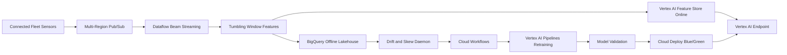

# AeroPredict

Predictive maintenance and IoT analytics platform for connected fleet
operations.

AeroPredict is a high-throughput streaming MLOps and DevOps platform for
predicting hardware failures across industrial assets such as aviation engines,
delivery fleets, and manufacturing equipment. It processes high-frequency
time-series telemetry, validates streaming features on the fly, serves
sub-second inference, and keeps model delivery zero-downtime through secure
blue/green deployment.

## What It Demonstrates

- Multi-region Cloud Pub/Sub ingestion for sensor telemetry
- Apache Beam/Dataflow tumbling window aggregation
- Terraform-managed streaming infrastructure
- Vertex AI Feature Store online path backed by Cloud Bigtable
- BigQuery offline lakehouse for historical training
- Drift and feature-skew triggered retraining through Cloud Workflows
- Vertex AI Pipelines using optimized XGBoost or TensorFlow containers
- VPC Service Controls for isolated training
- Cloud Deploy blue/green rollout to Vertex AI Endpoints

## Architecture



## Testing and Security Gates

- **Code and unit tests:** validate Python CLIs, policy logic, API handlers, and
  reusable ML utilities with `pytest` before merge.
- **Data and ML tests:** run schema checks, feature freshness checks, drift
  checks, model evaluation, and batch/streaming quality gates with pandas,
  Great Expectations, Evidently, and Vertex AI evaluation metadata.
- **Pipeline tests:** validate Kubeflow/Vertex AI pipeline components,
  container inputs/outputs, retry policy, artifact paths, and promotion evidence
  before production execution.
- **LLM and RAG tests:** evaluate prompt injection, PII leakage, groundedness,
  hallucination, toxicity, retrieval quality, token budget, and agent loop
  limits with Model Armor, Vertex AI Gen AI evaluation, Ragas, or DeepEval.
- **CI/CD security:** scan Terraform, Kubernetes manifests, dependencies, and
  container images using Prisma Cloud, Artifact Analysis, and policy-as-code;
  sign approved images with Cosign.
- **Admission and runtime security:** enforce Binary Authorization, Kubernetes
  network policies, Secret Manager/External Secrets, VPC Service Controls, and
  SentinelOne or Prisma Cloud runtime workload protection on GKE.
- **Release safety:** use canary, shadow, performance, chaos, and rollback tests
  with Cloud Deploy, Cloud Monitoring, OpenTelemetry, Eventarc, and Pub/Sub
  remediation workflows.

## Run

```bash
python3 src/aero_predict_gate.py evaluate \
  --release examples/fleet_release.json
```

## Interview Architecture

Explain this as a real-time IoT MLOps platform. Pub/Sub absorbs global sensor
traffic, Dataflow turns raw telemetry into windowed failure-risk features,
Feature Store and Bigtable serve low-latency online lookups, BigQuery stores the
offline training lakehouse, and Vertex AI Pipelines retrain models when drift is
detected.

## Interview Flow

1. Industrial assets stream telemetry into regional Pub/Sub topics.
2. Dataflow performs tumbling-window aggregation and feature validation.
3. Online features are written to Bigtable-backed serving paths; offline
   features are stored in BigQuery.
4. Drift or feature skew triggers Cloud Workflows to start a Vertex AI Pipeline.
5. Validated models are promoted with Cloud Deploy blue/green rollout to Vertex
   AI Endpoints, with rollback if latency spikes.

## Interview Talking Points

- IoT MLOps combines streaming data engineering and model lifecycle automation.
- Feature skew detection is critical when serving depends on fast-changing
  sensor windows.
- Blue/green endpoint rollout gives a safe fallback for mission-critical fleet
  operations.
- VPC Service Controls reduce data exfiltration risk for sensitive operational
  telemetry.
