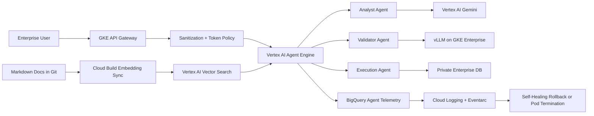

# OmniAgent

Multi-agent enterprise orchestration engine and security guardrail platform.

OmniAgent is a platform-engineering and LLMOps blueprint for building,
deploying, scaling, and monitoring network-isolated autonomous AI agents that
interact safely with private enterprise databases. It focuses on agentic
governance, private grounding, token/cost control, agent loop safety, and
runtime security on Google Cloud.

## What It Demonstrates

- Vertex AI Agent Engine and Agent Studio orchestration
- Multi-agent roles: analyst, validator, execution, and policy agents
- Gemini APIs and open-weight models served with vLLM on GKE Enterprise
- Vertex AI Vector Search for private RAG grounding
- Cloud Build doc-sync pipeline for markdown-to-embedding updates
- GKE API gateway for prompt/response interception
- Secret Manager injection and real-time PII sanitization
- Private Service Connect for private agent-to-agent communication
- BigQuery telemetry for tokens, latency, hallucination, and tool-call loops
- Eventarc and Cloud Logging self-healing for runaway agent sessions

## Architecture



## Testing and Security Gates

- **Code and unit tests:** validate Python CLIs, policy logic, API handlers, and
  reusable ML utilities with `pytest` before merge.
- **Data and ML tests:** run schema checks, feature freshness checks, drift
  checks, model evaluation, and batch/streaming quality gates with pandas,
  Great Expectations, Evidently, and Vertex AI evaluation metadata.
- **Pipeline tests:** validate Kubeflow/Vertex AI pipeline components,
  container inputs/outputs, retry policy, artifact paths, and promotion evidence
  before production execution.
- **LLM and RAG tests:** evaluate prompt injection, PII leakage, groundedness,
  hallucination, toxicity, retrieval quality, token budget, and agent loop
  limits with Model Armor, Vertex AI Gen AI evaluation, Ragas, or DeepEval.
- **CI/CD security:** scan Terraform, Kubernetes manifests, dependencies, and
  container images using Prisma Cloud, Artifact Analysis, and policy-as-code;
  sign approved images with Cosign.
- **Admission and runtime security:** enforce Binary Authorization, Kubernetes
  network policies, Secret Manager/External Secrets, VPC Service Controls, and
  SentinelOne or Prisma Cloud runtime workload protection on GKE.
- **Release safety:** use canary, shadow, performance, chaos, and rollback tests
  with Cloud Deploy, Cloud Monitoring, OpenTelemetry, Eventarc, and Pub/Sub
  remediation workflows.

## Run

```bash
python3 src/omni_agent_gate.py evaluate \
  --release examples/agent_platform_release.json
```

## Interview Architecture

Explain this as a secure agent platform rather than a single chatbot. Vertex AI
Agent Engine coordinates agents, Gemini and vLLM provide model backends, Vector
Search grounds agents with private context, a GKE gateway enforces privacy and
token controls, PSC keeps communication private, and BigQuery/Eventarc power
telemetry and self-healing.

## Interview Flow

1. A user request enters through the GKE API gateway.
2. The gateway sanitizes PII, injects approved secrets, and applies token policy.
3. Vertex AI Agent Engine coordinates analyst, validator, and execution agents.
4. Agents retrieve grounded context from Vertex AI Vector Search and call Gemini
   or vLLM-hosted open-weight models.
5. Tool calls to private databases stay inside PSC-protected private networking.
6. BigQuery receives token, latency, hallucination, and loop telemetry.
7. Eventarc terminates runaway sessions or rolls back unhealthy agent versions.

## Interview Talking Points

- Enterprise agents need platform controls: privacy, routing, grounding,
  telemetry, quota enforcement, and rollback.
- Agent loop detection is a production reliability concern, not a UX feature.
- Private Service Connect and sanitization protect enterprise data boundaries.
- Agentic systems need both LLMOps governance and SRE-style runtime controls.
