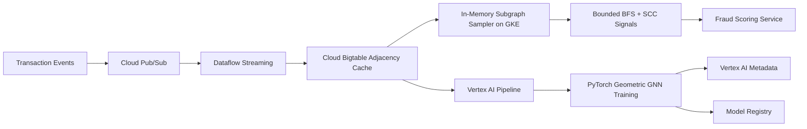

# GraphShield

Real-time financial fraud graph platform using custom graph traversals.

GraphShield models financial transactions as a dynamic heterogeneous graph,
where users, cards, merchants, and devices are nodes, and transactions are
edges. The platform focuses on low-latency fraud scoring using custom graph
algorithms, GNN training, and GCP-native streaming infrastructure.

## What It Demonstrates

- Custom in-memory subgraph sampler on GKE
- Thread-safe adjacency list design for dense transaction graphs
- Bounded-depth BFS neighborhood sampling under 30ms
- Strongly connected component detection with Tarjan or Kosaraju
- Pub/Sub and Dataflow streaming transaction processing
- Cloud Bigtable adjacency cache
- Vertex AI Pipelines for PyTorch Geometric GNN training
- Vertex AI Metadata lineage for graph schema and training snapshots
- Terraform and Argo CD deployment for memory-heavy GKE node pools

## Architecture



## Testing and Security Gates

- **Code and unit tests:** validate Python CLIs, policy logic, API handlers, and
  reusable ML utilities with `pytest` before merge.
- **Data and ML tests:** run schema checks, feature freshness checks, drift
  checks, model evaluation, and batch/streaming quality gates with pandas,
  Great Expectations, Evidently, and Vertex AI evaluation metadata.
- **Pipeline tests:** validate Kubeflow/Vertex AI pipeline components,
  container inputs/outputs, retry policy, artifact paths, and promotion evidence
  before production execution.
- **LLM and RAG tests:** evaluate prompt injection, PII leakage, groundedness,
  hallucination, toxicity, retrieval quality, token budget, and agent loop
  limits with Model Armor, Vertex AI Gen AI evaluation, Ragas, or DeepEval.
- **CI/CD security:** scan Terraform, Kubernetes manifests, dependencies, and
  container images using Prisma Cloud, Artifact Analysis, and policy-as-code;
  sign approved images with Cosign.
- **Admission and runtime security:** enforce Binary Authorization, Kubernetes
  network policies, Secret Manager/External Secrets, VPC Service Controls, and
  SentinelOne or Prisma Cloud runtime workload protection on GKE.
- **Release safety:** use canary, shadow, performance, chaos, and rollback tests
  with Cloud Deploy, Cloud Monitoring, OpenTelemetry, Eventarc, and Pub/Sub
  remediation workflows.

## Run

```bash
python3 src/graph_shield_gate.py evaluate \
  --release examples/graph_release.json
```

## Interview Architecture

Explain this as graph algorithms embedded inside an MLOps platform. Pub/Sub and
Dataflow build the streaming graph, Bigtable stores adjacency data, a custom GKE
sampler performs bounded BFS for real-time context, and Vertex AI trains a GNN
with full lineage.

## Interview Flow

1. Transactions stream into Pub/Sub.
2. Dataflow updates structural graph features and adjacency records.
3. Bigtable stores low-latency adjacency lists for live scoring.
4. The sampler extracts a depth-3 neighborhood using optimized BFS.
5. Fraud scoring combines sampler output, GNN embeddings, and transaction
   features under the latency budget.
6. Background SCC jobs detect laundering rings and feed training labels.

## Interview Talking Points

- DSA matters in MLOps when graph traversal latency directly affects fraud
  decisioning.
- Bounded BFS limits worst-case traversal cost in dense transaction networks.
- SCC detection gives investigators a graph-native laundering signal.
- Vertex AI Metadata makes graph schema, snapshots, and GNN hyperparameters
  auditable for financial compliance.
