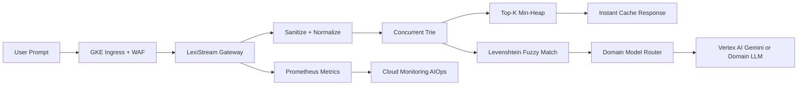

# LexiStream

Real-time intent routing and search suggestion engine with custom memory-aware
data structures.

LexiStream is an ultra-low-latency DevOps and LLMOps gateway that sits in front
of an enterprise GenAI search layer. It normalizes prompts, performs prefix and
fuzzy matching against cached queries, routes requests to domain models, and
avoids unnecessary expensive LLM calls.

## What It Demonstrates

- Concurrent compressed Trie for prefix matching
- Min-Heap priority queue for Top-K hot queries
- Early-terminating Levenshtein distance for fuzzy matching
- Rust or Go gateway on GKE
- eBPF-aware low-latency network routing pattern
- Secret Manager safety token injection
- WAF and prompt-injection filtering at ingress
- Prometheus metrics exported to Cloud Monitoring
- AIOps memory scaling and fallback Gemini endpoint provisioning

## Architecture



## Testing and Security Gates

- **Code and unit tests:** validate Python CLIs, policy logic, API handlers, and
  reusable ML utilities with `pytest` before merge.
- **Data and ML tests:** run schema checks, feature freshness checks, drift
  checks, model evaluation, and batch/streaming quality gates with pandas,
  Great Expectations, Evidently, and Vertex AI evaluation metadata.
- **Pipeline tests:** validate Kubeflow/Vertex AI pipeline components,
  container inputs/outputs, retry policy, artifact paths, and promotion evidence
  before production execution.
- **LLM and RAG tests:** evaluate prompt injection, PII leakage, groundedness,
  hallucination, toxicity, retrieval quality, token budget, and agent loop
  limits with Model Armor, Vertex AI Gen AI evaluation, Ragas, or DeepEval.
- **CI/CD security:** scan Terraform, Kubernetes manifests, dependencies, and
  container images using Prisma Cloud, Artifact Analysis, and policy-as-code;
  sign approved images with Cosign.
- **Admission and runtime security:** enforce Binary Authorization, Kubernetes
  network policies, Secret Manager/External Secrets, VPC Service Controls, and
  SentinelOne or Prisma Cloud runtime workload protection on GKE.
- **Release safety:** use canary, shadow, performance, chaos, and rollback tests
  with Cloud Deploy, Cloud Monitoring, OpenTelemetry, Eventarc, and Pub/Sub
  remediation workflows.

## Run

```bash
python3 src/lexi_stream_gate.py evaluate \
  --release examples/gateway_release.json
```

## Interview Architecture

Explain this as algorithmic acceleration in front of LLMs. The gateway uses a
compressed concurrent Trie for prefix lookup, a Min-Heap for hot-query ranking,
and bounded Levenshtein distance for fuzzy matching before routing to expensive
LLM endpoints.

## Interview Flow

1. A prompt enters through GKE ingress and WAF.
2. The gateway sanitizes and normalizes the input.
3. Trie lookup finds exact or prefix cache matches.
4. The Min-Heap maintains Top-K hot queries in `O(log K)`.
5. Early-terminating Levenshtein handles typo-tolerant routing.
6. Cache hits return immediately; misses route to Vertex AI Gemini or a
   domain-specific model.
7. Metrics drive AIOps scaling if miss rates or heap rebalance latency spike.

## Interview Talking Points

- DSA reduces LLM cost by resolving common queries before model invocation.
- Trie compression and lock-free design reduce memory pressure at scale.
- Heap-based Top-K tracking keeps hot topics fresh without scanning all queries.
- Fuzzy matching must be bounded to protect tail latency.
