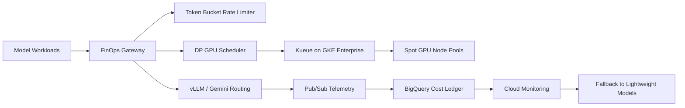

# FinPulse

Multi-agent FinOps broker and real-time GPU cluster optimizer.

FinPulse is an AIOps, DevSecOps, and LLMOps platform for reducing GPU
infrastructure waste. It profiles inference workloads, applies bin-packing
logic to GPU placement, enforces token budgets at the gateway, and routes
non-critical traffic to cheaper fallback models when cost or utilization
policies are breached.

## What It Demonstrates

- Dynamic programming for GPU workload bin packing
- Token bucket and leaky bucket rate limiting
- GKE Enterprise GPU workloads with Argo CD
- Kueue and Spot GPU scheduling
- vLLM and Vertex AI Gemini traffic interception
- Pub/Sub and BigQuery cost telemetry
- Prometheus and Cloud Monitoring cost anomaly triggers
- VPC Service Controls and fallback routing to Gemma-style models

## Architecture



## Testing and Security Gates

- **Code and unit tests:** validate Python CLIs, policy logic, API handlers, and
  reusable ML utilities with `pytest` before merge.
- **Data and ML tests:** run schema checks, feature freshness checks, drift
  checks, model evaluation, and batch/streaming quality gates with pandas,
  Great Expectations, Evidently, and Vertex AI evaluation metadata.
- **Pipeline tests:** validate Kubeflow/Vertex AI pipeline components,
  container inputs/outputs, retry policy, artifact paths, and promotion evidence
  before production execution.
- **LLM and RAG tests:** evaluate prompt injection, PII leakage, groundedness,
  hallucination, toxicity, retrieval quality, token budget, and agent loop
  limits with Model Armor, Vertex AI Gen AI evaluation, Ragas, or DeepEval.
- **CI/CD security:** scan Terraform, Kubernetes manifests, dependencies, and
  container images using Prisma Cloud, Artifact Analysis, and policy-as-code;
  sign approved images with Cosign.
- **Admission and runtime security:** enforce Binary Authorization, Kubernetes
  network policies, Secret Manager/External Secrets, VPC Service Controls, and
  SentinelOne or Prisma Cloud runtime workload protection on GKE.
- **Release safety:** use canary, shadow, performance, chaos, and rollback tests
  with Cloud Deploy, Cloud Monitoring, OpenTelemetry, Eventarc, and Pub/Sub
  remediation workflows.

## Run

```bash
python3 src/fin_pulse_gate.py evaluate \
  --release examples/gpu_release.json
```

## Interview Architecture

Explain this as FinOps embedded into the inference control plane. The gateway
captures workload shape and token usage, a DP scheduler packs workloads onto
the cheapest viable GPU pool, Kueue provisions GPU capacity, and monitoring
routes overflow or non-critical traffic to cheaper models.

## Interview Flow

1. Batch or online inference requests enter the gateway.
2. Token and cost quotas are enforced with bucket algorithms.
3. Workload memory and throughput needs feed a DP bin-packing scheduler.
4. Kueue schedules workloads onto A100, L4, T4, or Spot node pools.
5. Cost and latency telemetry streams to BigQuery and Cloud Monitoring.
6. If cost thresholds break, AIOps routes non-critical traffic to fallback
   open-weight models.

## Interview Talking Points

- FinOps becomes much stronger when scheduling decisions use real algorithms,
  not static instance choices.
- Token buckets protect cost budgets before downstream model calls happen.
- GPU placement must consider VRAM, throughput, latency, priority, and cost.
- AIOps fallback routing is a cost-control safety valve for GenAI platforms.
