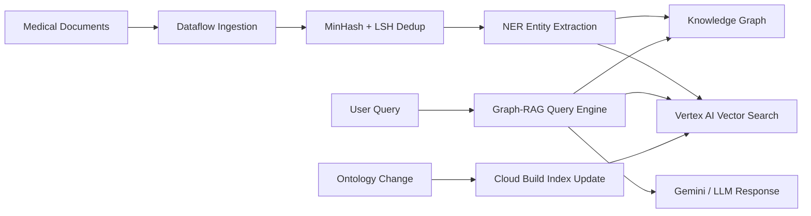

# BioGraphRAG

Knowledge-graph grounded biomedical RAG platform with graph search optimization.

BioGraphRAG combines dense vector search with explicit biomedical knowledge
graphs for multi-hop medical and pharmaceutical reasoning. It emphasizes
hallucination reduction, ontology-aware retrieval, MinHash/LSH deduplication,
and secure HIPAA-aligned document processing on GCP.

## What It Demonstrates

- A* or Dijkstra graph search over biomedical entities and relations
- MinHash and LSH deduplication before embedding generation
- Dataflow document ingestion and entity extraction
- Fine-tuned NER for symptoms, genes, diseases, and compounds
- Vertex AI Vector Search plus graph-based retrieval
- Vertex AI Pipelines for embedding and validation lifecycle
- Cloud Build incremental vector index updates
- Secret Manager controlled masking rules at GKE ingress

## Architecture



## Run

```bash
python3 src/bio_graph_rag_gate.py evaluate \
  --release examples/biograph_release.json
```

## Interview Architecture

Explain this as Graph-RAG for regulated biomedical reasoning. Dataflow ingests
papers, MinHash/LSH removes duplicates, NER extracts entities and relations,
Vector Search provides semantic retrieval, and graph search provides relational
paths for grounded multi-hop answers.

## Interview Flow

1. Medical documents stream into Dataflow.
2. MinHash and LSH remove near-duplicate chunks before embedding.
3. A fine-tuned NER model extracts biomedical entities and relations.
4. Entities populate a graph database while chunks update Vertex AI Vector
   Search.
5. Queries use vector retrieval plus A*/Dijkstra graph paths.
6. Ontology changes trigger Cloud Build to incrementally update indexes without
   downtime.

## Interview Talking Points

- Vector search alone often misses relational context in biomedical questions.
- Graph search helps produce explainable multi-hop evidence paths.
- MinHash and LSH reduce embedding cost and duplicate retrieval noise.
- HIPAA-aligned masking should happen before sensitive text reaches the model.
