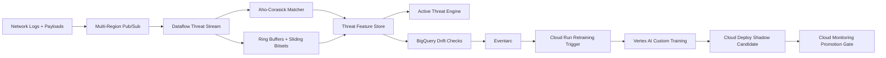

# CyberStream

High-throughput cyber-threat intelligence pipeline with custom sliding-window
automata.

CyberStream analyzes network logs, packet payloads, system calls, and
authentication events in real time. It combines high-performance string
matching, sliding-window feature extraction, Dataflow streaming, Vertex AI
training, and shadow deployment for safe threat-model promotion.

## What It Demonstrates

- Aho-Corasick automaton for multi-pattern malware signature matching
- Sliding-window bitsets and ring buffers for per-IP behavioral features
- Multi-region Pub/Sub and autoscaling Dataflow pipelines
- BigQuery drift calculations for threat feature distributions
- Eventarc-triggered Cloud Run retraining routines
- Vertex AI Custom Training with VPC Peering
- Cloud Deploy shadow deployment and zero-downtime promotion
- Cloud Monitoring comparison between active and candidate threat engines

## Architecture



## Run

```bash
python3 src/cyber_stream_gate.py evaluate \
  --release examples/threat_release.json
```

## Interview Architecture

Explain this as streaming cybersecurity MLOps. Pub/Sub and Dataflow process
security events, Aho-Corasick detects known signatures in one pass, ring buffers
maintain rolling behavioral features, BigQuery measures drift, and Vertex AI
updates the threat model through shadow deployment.

## Interview Flow

1. Network and auth events stream into multi-region Pub/Sub.
2. Dataflow extracts payload and behavioral features.
3. Aho-Corasick matches malware and C2 signatures in linear time.
4. Ring buffers track per-IP rolling windows without constant allocation.
5. BigQuery drift checks trigger Eventarc and Cloud Run retraining.
6. Vertex AI trains an updated classifier and Cloud Deploy shadows it beside
   production before promotion.

## Interview Talking Points

- Cybersecurity pipelines need deterministic fast-path detection plus ML.
- Aho-Corasick is ideal when tens of thousands of signatures must be matched in
  one pass.
- Ring buffers and bitsets avoid GC-heavy sliding-window implementations.
- Shadow deployment is safer than direct promotion for threat engines.
