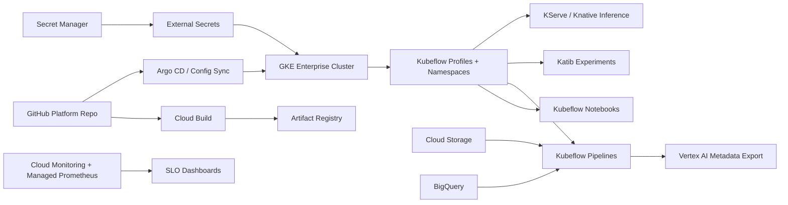

# KubeFlowForge

Multi-tenant Kubeflow ML factory on GKE Enterprise.

KubeFlowForge is a platform-engineering project for running Kubeflow as a
secure internal MLOps platform on GKE. It gives data science teams isolated
namespaces, notebook workspaces, Kubeflow Pipelines, Katib experimentation,
KServe inference, GPU scheduling, GitOps delivery, and production-grade
observability without asking every team to rebuild the platform.

## Architecture



## Interview Architecture

Explain this as a Kubernetes-native ML platform. GKE Enterprise provides the
runtime, Terraform provisions the cloud resources, Argo CD or Config Sync keeps
the desired state in Git, Kubeflow provides notebooks, pipelines, experiments,
and serving, and Google Cloud services provide storage, data warehouse,
secrets, artifacts, observability, and metadata.

## Flow

1. Platform engineers provision GKE, node pools, IAM, Artifact Registry,
   Storage, BigQuery, and Secret Manager using Terraform.
2. Argo CD or Config Sync installs Kubeflow profiles, pipelines, Katib, KServe,
   network policies, resource quotas, and tenant namespaces.
3. A data scientist launches a notebook inside a tenant profile and commits a
   KFP v2 pipeline definition to Git.
4. Cloud Build tests the code, builds containers, scans images, and publishes
   them to Artifact Registry.
5. Kubeflow Pipelines runs feature validation, training, evaluation, and model
   packaging jobs on isolated GKE workloads.
6. Katib runs hyperparameter search with quota-aware GPU scheduling.
7. KServe deploys the approved model with canary traffic, SLO metrics, and
   rollback gates.
8. Metadata and evidence are exported to Vertex AI Metadata or BigQuery for
   audit and portfolio storytelling.

## Senior Talking Points

- Kubeflow is useful when teams need Kubernetes-native control, custom runtime
  isolation, open-source portability, and self-managed platform extensions.
- GKE Enterprise, Workload Identity, NetworkPolicy, Secret Manager, and VPC
  Service Controls keep tenants isolated.
- Kueue and GPU node pools keep expensive accelerator workloads scheduled
  fairly.
- The production value is not just Kubeflow installation. It is tenancy,
  quotas, security, GitOps, observability, and release evidence.

## Testing and Security Gates

- **Code and unit tests:** validate Python CLIs, policy logic, API handlers, and
  reusable ML utilities with `pytest` before merge.
- **Data and ML tests:** run schema checks, feature freshness checks, drift
  checks, model evaluation, and batch/streaming quality gates with pandas,
  Great Expectations, Evidently, and Vertex AI evaluation metadata.
- **Pipeline tests:** validate Kubeflow/Vertex AI pipeline components,
  container inputs/outputs, retry policy, artifact paths, and promotion evidence
  before production execution.
- **LLM and RAG tests:** evaluate prompt injection, PII leakage, groundedness,
  hallucination, toxicity, retrieval quality, token budget, and agent loop
  limits with Model Armor, Vertex AI Gen AI evaluation, Ragas, or DeepEval.
- **CI/CD security:** scan Terraform, Kubernetes manifests, dependencies, and
  container images using Prisma Cloud, Artifact Analysis, and policy-as-code;
  sign approved images with Cosign.
- **Admission and runtime security:** enforce Binary Authorization, Kubernetes
  network policies, Secret Manager/External Secrets, VPC Service Controls, and
  SentinelOne or Prisma Cloud runtime workload protection on GKE.
- **Release safety:** use canary, shadow, performance, chaos, and rollback tests
  with Cloud Deploy, Cloud Monitoring, OpenTelemetry, Eventarc, and Pub/Sub
  remediation workflows.

## Run

```bash
python3 src/kubeflow_gke_gate.py evaluate \
  --release examples/kubeflow_platform_release.json
```
