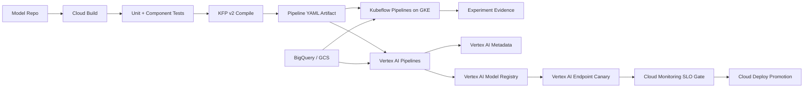

# PipelineBridge

Hybrid Kubeflow Pipelines and Vertex AI Pipelines governance platform.

PipelineBridge is a senior MLOps project for teams that want portable KFP v2
pipelines while still using managed Vertex AI for production-grade execution,
metadata, model registry, endpoints, and governance. The same pipeline spec can
run on Kubeflow on GKE for tenant-controlled workflows and on Vertex AI Pipelines
for managed production releases.

## Architecture



## Interview Architecture

Explain this as a portability and governance project. Kubeflow gives teams a
Kubernetes-native development and experimentation backend. Vertex AI Pipelines
gives managed orchestration, lineage, registry, and production integration. The
important engineering move is to standardize on KFP v2 components, compile once,
run on either backend, and enforce one release policy.

## Flow

1. A model team changes a pipeline component, feature transform, training image,
   or evaluation rule in Git.
2. Cloud Build runs Python tests, component contract tests, and container image
   scans.
3. The pipeline is compiled with the Kubeflow Pipelines SDK v2 into a portable
   pipeline YAML artifact.
4. Non-production runs execute on Kubeflow Pipelines on GKE for fast iteration
   inside tenant namespaces.
5. Production candidate runs execute on Vertex AI Pipelines with Google Cloud
   pipeline components.
6. Artifacts, metrics, parameters, datasets, prompt variants, and model versions
   are logged to Vertex AI Metadata and BigQuery evidence tables.
7. Passing models are registered in Vertex AI Model Registry and deployed by
   Cloud Deploy with canary, shadow, and rollback controls.
8. Cloud Monitoring SLOs decide whether the canary is promoted or rolled back.

## Senior Talking Points

- The strongest Kubeflow/GCP story is not "Kubeflow versus Vertex AI"; it is
  using KFP portability with managed production governance.
- KFP v2 components keep pipeline definitions portable across open-source
  Kubeflow backends and Vertex AI Pipelines.
- Vertex AI Metadata and Model Registry make release evidence interview-ready.
- Cloud Build and Cloud Deploy create a real software delivery story around ML
  workflows, not just notebook execution.

## Run

```bash
python3 src/hybrid_pipeline_gate.py evaluate \
  --release examples/hybrid_pipeline_release.json
```
