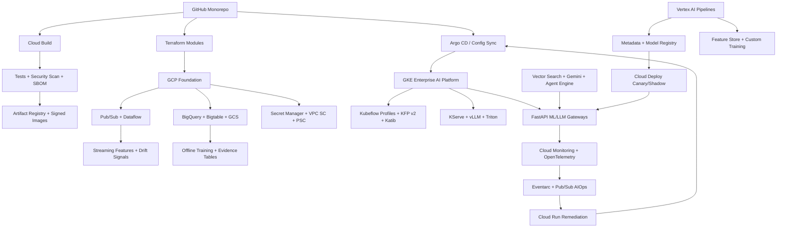

# AtlasAI

Enterprise AI and MLOps Operating System on GCP.

AtlasAI is the capstone project that combines the full portfolio into one
senior-level platform story. It is designed as an internal AI/MLOps operating
system for an enterprise that runs classical ML, real-time streaming ML,
GenAI/RAG, autonomous agents, edge models, fraud graphs, GPU optimization,
Kubeflow experimentation, Vertex AI production pipelines, DevSecOps controls,
GitOps delivery, and AIOps self-healing from one governed platform.

## What This Combines

- **Platform engineering:** GKE Enterprise, Terraform, Config Sync or Argo CD,
  Workload Identity, network policies, GPU node pools, Kueue, and multi-tenant
  namespaces.
- **MLOps lifecycle:** Vertex AI Pipelines, Kubeflow Pipelines v2, Experiments,
  Metadata, Model Registry, Feature Store, batch prediction, custom training,
  canary, shadow, and rollback.
- **LLMOps and GenAI:** Gemini, Vertex AI Agent Engine, Vertex AI Vector Search,
  Model Armor, prompt registry, RAG evaluation, open-weight vLLM/Triton serving,
  and token budget controls.
- **Data engineering:** Pub/Sub, Dataflow, BigQuery, Bigtable, Cloud Storage,
  Cloud Composer, Great Expectations, Evidently, and pandas/NumPy validation.
- **DevSecOps:** Cloud Build, Artifact Registry, Artifact Analysis, Cosign,
  Secret Manager, External Secrets, VPC Service Controls, Private Service
  Connect, Cloud Armor, Prisma Cloud, SentinelOne, Binary Authorization, and
  policy-as-code.
- **AIOps and SRE:** Cloud Monitoring, Cloud Logging, Cloud Trace,
  OpenTelemetry, Eventarc, Pub/Sub remediation topics, SLO burn-rate alerts,
  model drift, hallucination signals, and GitOps rollback automation.
- **FinOps and algorithms:** GPU bin packing, token buckets, graph traversal,
  Aho-Corasick matching, MinHash/LSH, trie-based routing, ring buffers, dynamic
  programming, and quota-aware fallback routing.

## Architecture



## Interview Architecture

Explain AtlasAI as the umbrella architecture that proves you can connect all
the individual systems:

1. **Foundation layer:** Terraform builds secure GCP foundations and GKE
   Enterprise clusters.
2. **Platform layer:** GitOps reconciles Kubeflow, inference gateways, model
   servers, policy, secrets, network rules, and tenant namespaces.
3. **Data layer:** Pub/Sub, Dataflow, BigQuery, Bigtable, and Cloud Storage
   power streaming and offline ML workflows.
4. **ML layer:** Kubeflow handles experimentation; Vertex AI handles governed
   production pipelines, metadata, registry, feature serving, and endpoints.
5. **GenAI layer:** RAG, Gemini, Agent Engine, Vector Search, Model Armor, and
   open-weight serving support enterprise GenAI workloads.
6. **Operations layer:** Cloud Monitoring, OpenTelemetry, Eventarc, and Pub/Sub
   close the loop with SLO-aware remediation and GitOps rollback.

## End-to-End Flow

1. A team submits a model, feature, prompt, agent, or infrastructure change to
   Git.
2. Cloud Build runs unit tests, data-contract tests, KFP component tests,
   security scans, image signing, and release gate checks.
3. Terraform and GitOps reconcile infrastructure, namespaces, policies, secrets,
   Kubeflow services, inference gateways, and model-serving manifests.
4. Kubeflow on GKE runs exploratory notebooks, KFP v2 workflows, and Katib
   tuning under tenant quotas.
5. Vertex AI Pipelines runs production candidates with Metadata, Model Registry,
   Feature Store, Vector Search, and evaluation evidence.
6. Dataflow streams features and telemetry into Bigtable online serving,
   BigQuery offline training, drift checks, and cost ledgers.
7. Cloud Deploy promotes models and gateways using canary, shadow, SLO, and
   rollback controls.
8. Cloud Monitoring detects drift, latency, hallucination, token overrun, GPU
   waste, or security risk.
9. Eventarc and Pub/Sub trigger Cloud Run remediation that opens or applies a
   policy-bound GitOps rollback.

## Testing and Security Stages

1. **Pull request:** unit tests, linting, dependency review, secret scanning,
   SAST, Terraform policy checks, and KFP component contract tests.
2. **Build:** Cloud Build creates SBOMs, scans containers with Artifact
   Analysis and Prisma Cloud, signs images with Cosign, and stores immutable
   artifacts in Artifact Registry.
3. **Pre-deploy:** Binary Authorization checks signatures and attestations;
   policy-as-code blocks privileged pods, public notebooks, broad IAM, and
   missing network policies.
4. **ML validation:** Vertex AI/Kubeflow pipelines run data contracts, model
   evaluation, drift checks, explainability evidence, and champion/challenger
   gates.
5. **LLM validation:** Model Armor, Vertex AI Gen AI evaluation, Ragas, and
   DeepEval check prompt injection, toxicity, hallucination, groundedness, and
   runaway agent loops.
6. **Runtime:** SentinelOne or Prisma Cloud protects GKE workloads against
   malware, suspicious process execution, crypto-mining, reverse shells, and
   workload drift.
7. **Production:** Cloud Monitoring, OpenTelemetry, Cloud Logging, and BigQuery
   evidence tables track SLOs, token cost, model quality, security alerts, and
   rollback history.

## Interview Talking Points

- This is the project to discuss when an interviewer asks, "Can you design the
  whole platform?"
- It shows a 10-year engineering mindset: platform control plane, ML lifecycle,
  data reliability, security, cost, observability, and incident automation.
- Kubeflow and Vertex AI are not competing ideas here. Kubeflow is used for
  open-source, Kubernetes-native team workflows; Vertex AI is used for managed
  production governance.
- GenAI work is treated like production software: prompts, retrieval configs,
  vector indexes, agents, token budgets, and safety evaluations all have
  versioning, telemetry, and rollback.
- Algorithms are part of platform engineering when latency, memory, and cost
  matter.

## Testing and Security Gates

- **Code and unit tests:** validate Python CLIs, policy logic, API handlers, and
  reusable ML utilities with `pytest` before merge.
- **Data and ML tests:** run schema checks, feature freshness checks, drift
  checks, model evaluation, and batch/streaming quality gates with pandas,
  Great Expectations, Evidently, and Vertex AI evaluation metadata.
- **Pipeline tests:** validate Kubeflow/Vertex AI pipeline components,
  container inputs/outputs, retry policy, artifact paths, and promotion evidence
  before production execution.
- **LLM and RAG tests:** evaluate prompt injection, PII leakage, groundedness,
  hallucination, toxicity, retrieval quality, token budget, and agent loop
  limits with Model Armor, Vertex AI Gen AI evaluation, Ragas, or DeepEval.
- **CI/CD security:** scan Terraform, Kubernetes manifests, dependencies, and
  container images using Prisma Cloud, Artifact Analysis, and policy-as-code;
  sign approved images with Cosign.
- **Admission and runtime security:** enforce Binary Authorization, Kubernetes
  network policies, Secret Manager/External Secrets, VPC Service Controls, and
  SentinelOne or Prisma Cloud runtime workload protection on GKE.
- **Release safety:** use canary, shadow, performance, chaos, and rollback tests
  with Cloud Deploy, Cloud Monitoring, OpenTelemetry, Eventarc, and Pub/Sub
  remediation workflows.

## Run

```bash
python3 src/atlas_ai_gate.py evaluate \
  --release examples/atlas_ai_release.json
```
