# GCP MLOps Interview Portfolio

This portfolio is built for ML Platform, MLOps Infrastructure, and ML SRE
interviews. It is intentionally aligned with a DevOps-to-MLOps transition story:
strong Kubernetes, CI/CD, Terraform, GCP, observability, and automation
experience applied to ML systems.

## Positioning

Use this repository section to show that you can move beyond traditional DevOps
and operate the full ML platform lifecycle:

- Provision GCP infrastructure with Terraform
- Run ML workloads on GKE
- Build CI/CD pipelines for model serving services
- Promote models with quality and approval gates
- Monitor inference reliability, drift, and latency
- Automate incident triage using Pub/Sub-driven workflows
- Prevent training/serving skew with feature consistency gates
- Quarantine risky batch inference outputs before downstream publishing
- Deploy Hugging Face models on Vertex AI with LLMOps release gates
- Operate end-to-end Vertex AI ML lifecycles with release governance
- Route LLM-assisted AIOps remediation through GitOps safety controls
- Scale enterprise forecasting, LLM governance, edge vision, and financial fraud
  MLOps systems
- Converge platform engineering, GitOps, security, streaming infrastructure,
  and MLOps lifecycle automation
- Run autonomous self-healing GenAI and agentic platforms with DevSecOps,
  LLMOps, and AIOps controls
- Operate IoT streaming predictive maintenance and secure enterprise
  multi-agent platforms
- Use graph traversal, tries, heaps, and dynamic programming to reduce ML
  serving latency and cloud cost
- Optimize GPU FinOps, biomedical Graph-RAG, and cybersecurity streaming with
  algorithmic platform components
- Explain SLOs, GitOps, model lineage, and production readiness

## Project Index

| # | Project | Focus Area | Main GCP/Platform Skills |
|---|---|---|---|
| 01 | GKE ML Platform Blueprint | Platform architecture | GKE, Terraform, GCS, GPU node pools, Helm/GitOps style manifests |
| 02 | Model Promotion Gates | Model lifecycle | MLflow-style registry, approval gates, lineage, Python automation |
| 03 | ML Observability SRE | Reliability engineering | p99 latency, error rate, drift, Prometheus alerts, SLO reporting |
| 04 | Cloud Build GKE ML CI/CD | Delivery automation | Cloud Build, Artifact Registry, GKE rollout, Kustomize overlays |
| 05 | Vertex AI Monitoring Blueprint | Managed MLOps | Vertex AI monitoring concepts, BigQuery logs, Pub/Sub alerts |
| 06 | Pub/Sub ML Incident Automation | Incident response | Pub/Sub, Cloud Function style routing, runbooks, severity mapping |
| 07 | Feature Store Consistency Guardrails | Feature reliability | Offline/online parity, freshness SLAs, feature contracts, CI gates |
| 08 | Batch Inference Quality Gates | Batch ML operations | Data quality policy, completeness checks, quarantine workflow, audit summaries |
| 09 | Vertex AI Hugging Face LLMOps Blueprint | LLMOps and managed serving | Vertex AI, Hugging Face, Cloud Build, Artifact Registry, BigQuery, release gates |
| 10 | Vertex AI MLOps Control Plane | End-to-end ML lifecycle | Vertex AI Pipelines, Experiments, Model Registry, Feature Store, monitoring, retraining |
| 11 | GCP LLM AIOps GitOps Remediation | AIOps and GitOps operations | Cloud Monitoring, Pub/Sub, Vertex AI Gemini pattern, GKE, Config Sync/Argo CD, policy guardrails |
| 12 | ChronosSupply | Batch forecasting MLOps | Cloud Composer, Dataflow, Great Expectations, BigQuery ML, Vertex AI, Memorystore |
| 13 | ShieldLLM | Enterprise LLMOps governance | GKE, FastAPI, Vertex AI Gemini, Pub/Sub, BigQuery, Vertex AI Metadata, Ragas/DeepEval |
| 14 | VisionEdge | Hybrid edge-cloud vision MLOps | Vertex AI Custom Training, GPUs, TensorRT, Edge TPU, Anthos/GKE Enterprise, MQTT/Pub/Sub |
| 15 | NexusFraud | Real-time financial anomaly MLOps | Apache Beam, Dataflow, Vertex AI Feature Store, Vertex AI Pipelines, Metadata, canary/shadow deploys |
| 16 | ClearRoute | Multi-tenant healthcare MLOps platform | GKE Enterprise, Anthos, Terraform, Config Connector, Argo CD, Kubeflow, Vertex AI, HIPAA-aligned controls |
| 17 | AdStream | Streaming ad recommendation platform | Terraform, Cloud Deploy, Dataflow, Pub/Sub, Vertex AI Feature Store, Bigtable, BigQuery, SLO rollback |
| 18 | AegisSphere | Autonomous GenAI and agentic platform | GKE Enterprise, Terraform, Argo CD, Cloud Build, Artifact Analysis, Cosign, Vertex AI, Vector Search, Triton, AIOps |
| 19 | AeroPredict | IoT predictive maintenance MLOps | Multi-region Pub/Sub, Dataflow, Vertex AI Feature Store, Bigtable, BigQuery, Cloud Workflows, Cloud Deploy |
| 20 | OmniAgent | Secure multi-agent LLMOps platform | Vertex AI Agent Engine, Agent Studio, Gemini, GKE Enterprise, vLLM, Vector Search, PSC, Eventarc |
| 21 | GraphShield | Real-time fraud graph MLOps | GKE, Go/C++ sampler, BFS, SCC detection, Pub/Sub, Dataflow, Bigtable, Vertex AI Pipelines, PyTorch Geometric |
| 22 | LexiStream | Low-latency GenAI routing gateway | Rust/Go, concurrent Trie, Min-Heap, Levenshtein DP, GKE, eBPF, Secret Manager, WAF, Cloud Monitoring |
| 23 | FinPulse | GPU FinOps and AIOps optimizer | GKE Enterprise, Kueue, Spot GPUs, DP bin packing, token buckets, vLLM, Gemini, BigQuery, Cloud Monitoring |
| 24 | BioGraphRAG | Biomedical Graph-RAG platform | Dataflow, MinHash, LSH, A*/Dijkstra, Vertex AI Vector Search, Vertex AI Pipelines, Cloud Build, Secret Manager |
| 25 | CyberStream | Cyber-threat streaming MLOps | Pub/Sub, Dataflow, Aho-Corasick, ring buffers, BigQuery drift, Eventarc, Cloud Run, Vertex AI, Cloud Deploy |

## Portfolio Architecture

```mermaid
flowchart TD
    A[DevOps to MLOps Portfolio] --> B[01 GKE ML Platform Blueprint]
    A --> C[02 Model Promotion Gates]
    A --> D[03 ML Observability SRE]
    A --> E[04 Cloud Build GKE ML CI/CD]
    A --> F[05 Vertex AI Monitoring Blueprint]
    A --> G[06 Pub/Sub ML Incident Automation]
    A --> O[07 Feature Store Consistency Guardrails]
    A --> P[08 Batch Inference Quality Gates]
    A --> Q[09 Vertex AI Hugging Face LLMOps Blueprint]
    A --> R[10 Vertex AI MLOps Control Plane]
    A --> S[11 GCP LLM AIOps GitOps Remediation]
    A --> T[12 ChronosSupply]
    A --> U[13 ShieldLLM]
    A --> V[14 VisionEdge]
    A --> W[15 NexusFraud]
    A --> X[16 ClearRoute]
    A --> Y[17 AdStream]
    A --> Z[18 AegisSphere]
    A --> AA[19 AeroPredict]
    A --> AB[20 OmniAgent]
    A --> AC[21 GraphShield]
    A --> AD[22 LexiStream]
    A --> AE[23 FinPulse]
    A --> AF[24 BioGraphRAG]
    A --> AG[25 CyberStream]

    B --> H[GKE Runtime Platform]
    B --> I[GCS Model Artifacts]
    E --> H
    E --> J[Artifact Registry]
    C --> I
    C --> K[Model Registry and Lineage]
    D --> L[SLO Signals]
    F --> L
    F --> M[BigQuery Prediction Logs]
    L --> G
    G --> N[Runbooks and Incident Routing]
    O --> C
    O --> K
    P --> L
    P --> N
    Q --> J
    Q --> M
    Q --> L
    R --> K
    R --> L
    R --> M
    R --> N
    S --> G
    S --> H
    S --> N
    T --> M
    T --> K
    U --> M
    U --> L
    V --> J
    V --> L
    W --> K
    W --> M
    X --> H
    X --> K
    Y --> K
    Y --> L
    Z --> H
    Z --> J
    Z --> L
    Z --> N
    AA --> K
    AA --> L
    AB --> M
    AB --> L
    AC --> K
    AC --> L
    AD --> J
    AD --> L
    AE --> J
    AE --> L
    AF --> M
    AF --> L
    AG --> L
    AG --> K
```



## End-to-End Story

1. Build the ML platform foundation on GKE with Terraform and GitOps.
2. Deliver inference services through Cloud Build, Artifact Registry, and GKE.
3. Promote models only when quality, latency, and approval gates pass.
4. Monitor inference reliability and model drift with SLO-focused tooling.
5. Route alerts into Pub/Sub-based incident automation with runbook ownership.
6. Guard feature contracts and batch inference outputs before they affect users
   or downstream business workflows.
7. Apply LLMOps controls to Hugging Face models deployed through Vertex AI.
8. Govern full Vertex AI ML releases from data contracts to retraining triggers.
9. Use LLM-assisted AIOps to propose safe GitOps remediation with human approval.
10. Demonstrate domain-scale MLOps across forecasting, LLM governance,
    industrial edge vision, and regulated fraud detection.
11. Show senior platform engineering through multi-tenant GitOps healthcare
    MLOps and high-throughput streaming feature infrastructure.
12. Operate a self-healing GenAI platform where DevOps, DevSecOps, LLMOps, and
    AIOps are designed as one production control plane.
13. Extend the portfolio into IoT predictive maintenance and secure enterprise
    multi-agent orchestration.
14. Demonstrate DSA-driven platform engineering with graph traversal and
    memory-optimized text routing systems.
15. Add FinOps, biomedical Graph-RAG, and cybersecurity streaming systems where
    algorithms directly shape reliability, latency, and cost.

## 01. GKE ML Platform Blueprint

Path: `01-gke-ml-platform-blueprint`

A GCP/GKE platform blueprint for ML workloads. It includes Terraform,
Kubernetes manifests, autoscaling examples, an MLflow tracking deployment, an
inference service, and GitOps-ready ArgoCD application config.

Showcases:

- GKE-oriented ML platform architecture
- GCS model artifact storage
- MLflow-style tracking service
- Real-time inference deployment
- HPA-based inference autoscaling
- GPU node pool blueprint
- GitOps-ready Kubernetes manifests

Interview angle:

> "I can design and operate the Kubernetes foundation that ML teams need for
> repeatable training, serving, and promotion workflows."

## 02. Model Promotion Gates

Path: `02-model-promotion-gates`

A Python CLI that simulates model promotion from `candidate` to `staging` or
`production` using quality gates.

Showcases:

- MLflow/model-registry style promotion
- Accuracy, latency, and error-rate gates
- Approval-based production promotion
- JSON lineage registry
- CI-friendly tests

Interview angle:

> "I understand that MLOps is not just deploying containers. Model releases need
> metrics, lineage, approval, and rollback-safe promotion."

## 03. ML Observability SRE

Path: `03-ml-observability-sre`

A lightweight ML SRE toolkit for analyzing inference logs and producing SLO
signals.

Showcases:

- p95/p99 latency calculation
- Error-rate monitoring
- Drift score monitoring
- Burn-rate style alert decisions
- Prometheus alert rule examples
- Interview-ready incident summary output

Interview angle:

> "I can apply SRE practices to ML systems, including latency, availability, and
> model-quality signals like drift."

## 04. Cloud Build GKE ML CI/CD

Path: `04-cloud-build-gke-ml-cicd`

A GCP-native CI/CD pipeline for an ML inference service. It includes Cloud
Build stages, a simple Python inference API, Dockerfile, Artifact Registry
Terraform, and Kustomize overlays for dev/prod promotion.

Showcases:

- Cloud Build pipeline design
- Docker image build and push
- Artifact Registry repository provisioning
- GKE deployment rollout
- Smoke-test stage after deployment
- Kustomize environment overlays

Interview angle:

> "I can convert traditional CI/CD experience into ML serving pipelines that
> build, deploy, verify, and promote inference services safely."

## 05. Vertex AI Monitoring Blueprint

Path: `05-vertex-ai-monitoring-blueprint`

A managed GCP MLOps monitoring blueprint with policy validation. It models
Vertex AI monitoring concepts, BigQuery prediction logging, and Pub/Sub alert
routing.

Showcases:

- Vertex AI endpoint monitoring design
- Feature drift and prediction drift thresholds
- BigQuery monitoring dataset
- Pub/Sub alert topic
- Version-controlled monitoring policies
- Python validation CLI

Interview angle:

> "I know when to use managed Vertex AI monitoring and how to connect it with
> data, alerting, and incident response systems."

## 06. Pub/Sub ML Incident Automation

Path: `06-pubsub-ml-incident-automation`

A Cloud Function-style alert router for ML incidents. It reads Pub/Sub-style
alert payloads, maps them to owners and runbooks, and produces incident
summaries.

Showcases:

- Pub/Sub-driven alert routing
- Cloud Function-compatible Python handler
- Runbook mapping by alert type
- Severity classification
- Incident response recommendations
- Terraform topic/subscription foundation

Interview angle:

> "I can close the loop from monitoring to actionable operations by automating
> incident triage and runbook routing."

## 07. Feature Store Consistency Guardrails

Path: `07-feature-store-consistency`

A feature reliability project that validates feature contracts, offline/online
schema parity, freshness SLAs, and nullability before a model is promoted.

Showcases:

- Feature contract enforcement
- Training/serving skew prevention
- Freshness SLA validation
- Offline and online schema comparison
- CI-friendly Python quality gates
- Owner-focused failure output

Interview angle:

> "I know feature stores need operational guardrails. A model should not ship
> if its serving features are stale, missing, or different from training."

## 08. Batch Inference Quality Gates

Path: `08-batch-inference-quality-gates`

A batch inference operations project that evaluates input quality and prediction
output completeness before publishing a scored batch downstream.

Showcases:

- Batch manifest validation
- Duplicate and missing-feature checks
- Prediction completeness gates
- Publish versus quarantine decisions
- Audit-friendly JSON summaries
- CI-friendly pipeline policy tests

Interview angle:

> "I can operate batch ML workflows with production release discipline, including
> quality gates, quarantine paths, and owner-ready failure summaries."

## 09. Vertex AI Hugging Face LLMOps Blueprint

Path: `09-vertex-ai-huggingface-llmops`

A managed LLMOps blueprint for deploying a Hugging Face model on Vertex AI with
release gates around model metadata, evaluation metrics, safety, latency, cost,
logging, monitoring, and rollback readiness.

Showcases:

- Hugging Face model metadata governance
- Vertex AI endpoint deployment planning
- Cloud Build and Artifact Registry serving workflow
- LLM quality, safety, latency, and cost gates
- BigQuery prediction logging design
- Cloud Monitoring and Pub/Sub alert integration
- FastAPI serving container skeleton

Interview angle:

> "I can combine open-source model velocity with managed cloud operations:
> Vertex AI serving, release gates, observability, and rollback controls."

## 10. Vertex AI MLOps Control Plane

Path: `10-vertex-ai-mlops-control-plane`

A 10-years-experience style MLOps blueprint for operating the full machine
learning lifecycle on GCP: dataset contracts, Vertex AI Pipelines, experiment
lineage, model registry approval, canary deployment, monitoring, retraining,
and audit governance.

Showcases:

- Dataset contract and feature freshness validation
- Vertex AI training pipeline reproducibility policy
- Experiment and model lineage requirements
- Offline ML quality, calibration, and fairness gates
- Model registry approval workflow
- Canary rollout and rollback readiness
- Drift, skew, data quality, latency, and error-rate monitoring
- Retraining trigger policy
- Governance and audit metadata

Interview angle:

> "I can design the ML control plane around Vertex AI so data scientists can
> ship models through a governed, observable, repeatable production path."

## 11. GCP LLM AIOps GitOps Remediation

Path: `11-gcp-llm-aiops-gitops`

An AIOps and GitOps project that uses alert context, runbook matching, and
LLM-style remediation proposals to create safe GitOps pull request candidates
for GKE production incidents.

Showcases:

- Cloud Monitoring and Cloud Logging incident context
- Pub/Sub-driven AIOps triage workflow
- LLM-assisted runbook matching and summary generation
- GitOps remediation proposal validation
- Config Sync or Argo CD deployment pattern
- Human approval, rollback, and blast-radius guardrails
- Audit-friendly incident and change output

Interview angle:

> "I can use LLMs to speed up operations while keeping GitOps, policy checks,
> approval, and rollback as the production control plane."

## 12. ChronosSupply

Path: `12-chronos-supply`

An enterprise multi-echelon demand forecasting platform for millions of
SKU-store combinations. It validates retail logs with Great Expectations on
Dataflow, orchestrates BQML and Vertex AI training through Cloud Composer,
evaluates challenger models by segment, and serves micro-batched forecasts to
BigQuery and Memorystore.

Interview angle:

> "I can design high-throughput batch MLOps systems where data quality,
> segment-level performance, cost control, and serving SLAs are release gates."

## 13. ShieldLLM

Path: `13-shield-llm`

An enterprise LLMOps gateway and guardrails platform for GKE and Vertex AI
Gemini. It validates a 9-layer prompt/response safety pipeline, async
Ragas/DeepEval-style evaluation, Pub/Sub telemetry, BigQuery governance logs,
and Vertex AI Metadata lineage.

Interview angle:

> "I can operate LLMs as governed enterprise systems with gateway controls,
> telemetry, evaluation, and auditability."

## 14. VisionEdge

Path: `14-vision-edge`

A hybrid cloud-edge vision MLOps platform for industrial quality control. It
models Vertex AI GPU training, TensorRT and Edge TPU optimization, Artifact
Registry promotion, GKE Enterprise edge rollout, sub-10ms inference gates, and
edge telemetry for selective retraining.

Interview angle:

> "I can design MLOps for edge environments where latency, bandwidth,
> zero-downtime rollout, and training-serving skew are first-class constraints."

## 15. NexusFraud

Path: `15-nexus-fraud`

A regulated real-time financial anomaly platform. It validates Dataflow
streaming, Vertex AI Feature Store online serving, Vertex AI Pipelines and
Cloud Composer orchestration, Vertex AI Metadata lineage, drift-triggered
continuous training, and canary/shadow deployment readiness.

Interview angle:

> "I can build mission-critical fraud MLOps systems with streaming features,
> auditability, drift-triggered retraining, and zero-downtime model delivery."

## 16. ClearRoute

Path: `16-clear-route`

A multi-tenant GitOps MLOps platform for healthcare analytics. It validates GKE
Enterprise hub-and-spoke architecture, Terraform and Config Connector resource
management, Argo CD delivery, Kubeflow on GKE, Cloud Build image security,
Vertex AI training, BigQuery access, VPC isolation, custom IAM, and
HIPAA-aligned controls.

Interview angle:

> "I can build MLOps-as-a-Service platforms where tenant isolation, GitOps,
> secure infrastructure, and model lifecycle automation all work together."

## 17. AdStream

Path: `17-ad-stream`

A high-throughput streaming ad-recommendation and GitOps feature infrastructure
project. It validates Terraform-managed streaming infrastructure, Cloud Deploy
blue/green Dataflow releases, Pub/Sub clickstream ingestion, Vertex AI Feature
Store online/offline paths, Bigtable online serving, BigQuery training data,
Cloud Build tests, and SLO-based rollback.

Interview angle:

> "I can operate streaming feature and model delivery systems where Dataflow,
> Feature Store, Cloud Deploy, CI/CD, and SLO rollback protect a 50k+ RPS
> recommendation path."

## 18. AegisSphere

Path: `18-aegis-sphere`

An autonomous self-healing Generative AI and agentic platform on GKE Enterprise.
It validates Terraform-managed multi-tenant infrastructure, Argo CD GitOps,
Cloud Build secure supply chain, Artifact Analysis, Cosign image signing, VPC
Service Controls, External Secrets, Vertex AI Pipelines, Feature Store, Vector
Search, Gemini, Triton open-weights serving, Vertex AI Metadata, and AIOps
self-healing loops for latency, token budget, hallucination, and fallback model
routing.

Interview angle:

> "I can design a mission-critical GenAI platform where DevOps, DevSecOps,
> LLMOps, and AIOps converge into a secure, governed, self-healing production
> control plane."

## 19. AeroPredict

Path: `19-aero-predict`

A predictive maintenance and IoT analytics platform for connected fleet
operations. It validates multi-region Pub/Sub ingestion, Apache Beam/Dataflow
tumbling-window features, Vertex AI Feature Store online/offline paths,
Bigtable sub-10ms lookup, BigQuery training lakehouse, Cloud Workflows
drift-triggered retraining, VPC Service Controls, and Cloud Deploy blue/green
rollout to Vertex AI Endpoints.

Interview angle:

> "I can build streaming IoT MLOps platforms where telemetry ingestion,
> real-time feature engineering, drift-triggered retraining, and zero-downtime
> model deployment work as one system."

## 20. OmniAgent

Path: `20-omni-agent`

A secure multi-agent enterprise orchestration and guardrail platform. It
validates Vertex AI Agent Engine, Agent Studio, Gemini, vLLM on GKE Enterprise,
Vertex AI Vector Search grounding, Cloud Build document embedding sync, GKE API
gateway controls, Secret Manager injection, PII sanitization, Private Service
Connect, BigQuery telemetry, and Eventarc self-healing for runaway agent loops.

Interview angle:

> "I can design agentic platforms where autonomous workflows are grounded,
> private, observable, quota-controlled, and safe to operate against enterprise
> systems."

## 21. GraphShield

Path: `21-graph-shield`

A real-time financial fraud graph platform using custom graph traversals. It
validates an in-memory subgraph sampler, optimized adjacency lists, bounded
depth-3 BFS, Tarjan/Kosaraju SCC detection, Pub/Sub and Dataflow streaming,
Bigtable adjacency cache, GKE memory-optimized node pools, Vertex AI Pipelines,
PyTorch Geometric GNN training, and Vertex AI Metadata lineage.

Interview angle:

> "I can apply DSA to production MLOps by using bounded graph traversal and
> connected-component algorithms to meet low-latency fraud detection SLAs."

## 22. LexiStream

Path: `22-lexi-stream`

A real-time intent routing and search suggestion gateway using custom
memory-aware data structures. It validates a concurrent compressed Trie,
Min-Heap Top-K tracking, early-terminating Levenshtein distance, Rust/Go on
GKE, eBPF routing, Secret Manager safety tokens, WAF prompt-injection filtering,
Prometheus metrics, Cloud Monitoring, and AIOps memory/fallback scaling.

Interview angle:

> "I can reduce GenAI cost and latency by combining systems programming,
> efficient data structures, and cloud-native LLM routing infrastructure."

## 23. FinPulse

Path: `23-fin-pulse`

A multi-agent FinOps broker and GPU cluster optimizer. It validates dynamic
programming GPU bin packing, token bucket and leaky bucket rate limiting, GKE
Enterprise, Argo CD, Kueue, Spot GPU nodes, vLLM and Gemini routing, Pub/Sub and
BigQuery cost telemetry, VPC Service Controls, Prometheus, Cloud Monitoring,
and fallback routing to smaller open-weight models.

Interview angle:

> "I can reduce GenAI platform cost by combining algorithmic GPU scheduling,
> quota enforcement, telemetry, and AIOps fallback routing."

## 24. BioGraphRAG

Path: `24-bio-graph-rag`

A knowledge-graph grounded biomedical RAG platform. It validates A*/Dijkstra
graph search, MinHash and LSH deduplication, Dataflow document ingestion,
fine-tuned NER, knowledge graph construction, Vertex AI Vector Search, Vertex
AI Pipelines, Cloud Build incremental index updates, HIPAA-aligned masking, and
Secret Manager controls.

Interview angle:

> "I can design Graph-RAG systems where vector retrieval, graph search, and
> compliance controls work together for grounded biomedical reasoning."

## 25. CyberStream

Path: `25-cyber-stream`

A high-throughput cyber-threat intelligence pipeline. It validates
Aho-Corasick multi-pattern matching, sliding-window bitsets, ring buffers,
multi-region Pub/Sub, autoscaling Dataflow, BigQuery drift checks, Eventarc,
Cloud Run retraining triggers, Vertex AI Custom Training with VPC Peering,
Cloud Deploy shadow deployment, and Cloud Monitoring promotion gates.

Interview angle:

> "I can build cybersecurity MLOps systems where deterministic automata,
> streaming ML features, and shadow deployment protect high-volume threat
> detection paths."

## How To Validate

Run all Python tests:

```bash
python3 -m pytest GCP/mlops_interview_portfolio
```

Validate market-stack coverage:

```bash
python3 -m pytest GCP/mlops_interview_portfolio/tests/test_market_stack_coverage.py
```

Run Terraform formatting checks:

```bash
terraform -chdir=GCP/mlops_interview_portfolio/01-gke-ml-platform-blueprint/terraform fmt -check
terraform -chdir=GCP/mlops_interview_portfolio/04-cloud-build-gke-ml-cicd/terraform fmt -check
terraform -chdir=GCP/mlops_interview_portfolio/05-vertex-ai-monitoring-blueprint/terraform fmt -check
terraform -chdir=GCP/mlops_interview_portfolio/06-pubsub-ml-incident-automation/terraform fmt -check
terraform -chdir=GCP/mlops_interview_portfolio/09-vertex-ai-huggingface-llmops/terraform fmt -check
terraform -chdir=GCP/mlops_interview_portfolio/10-vertex-ai-mlops-control-plane/terraform fmt -check
terraform -chdir=GCP/mlops_interview_portfolio/11-gcp-llm-aiops-gitops/terraform fmt -check
terraform -chdir=GCP/mlops_interview_portfolio/12-chronos-supply/terraform fmt -check
terraform -chdir=GCP/mlops_interview_portfolio/13-shield-llm/terraform fmt -check
terraform -chdir=GCP/mlops_interview_portfolio/14-vision-edge/terraform fmt -check
terraform -chdir=GCP/mlops_interview_portfolio/15-nexus-fraud/terraform fmt -check
terraform -chdir=GCP/mlops_interview_portfolio/16-clear-route/terraform fmt -check
terraform -chdir=GCP/mlops_interview_portfolio/17-ad-stream/terraform fmt -check
terraform -chdir=GCP/mlops_interview_portfolio/18-aegis-sphere/terraform fmt -check
terraform -chdir=GCP/mlops_interview_portfolio/19-aero-predict/terraform fmt -check
terraform -chdir=GCP/mlops_interview_portfolio/20-omni-agent/terraform fmt -check
terraform -chdir=GCP/mlops_interview_portfolio/21-graph-shield/terraform fmt -check
terraform -chdir=GCP/mlops_interview_portfolio/22-lexi-stream/terraform fmt -check
terraform -chdir=GCP/mlops_interview_portfolio/23-fin-pulse/terraform fmt -check
terraform -chdir=GCP/mlops_interview_portfolio/24-bio-graph-rag/terraform fmt -check
terraform -chdir=GCP/mlops_interview_portfolio/25-cyber-stream/terraform fmt -check
```

Run CLI demos:

```bash
python3 GCP/mlops_interview_portfolio/02-model-promotion-gates/src/promotion_cli.py evaluate \
  --registry GCP/mlops_interview_portfolio/02-model-promotion-gates/examples/registry.json \
  --model-id churn-model-v3 \
  --target staging

python3 GCP/mlops_interview_portfolio/03-ml-observability-sre/src/ml_sre_report.py \
  --logs GCP/mlops_interview_portfolio/03-ml-observability-sre/examples/inference_logs.jsonl

python3 GCP/mlops_interview_portfolio/05-vertex-ai-monitoring-blueprint/src/monitoring_policy.py validate \
  --policy GCP/mlops_interview_portfolio/05-vertex-ai-monitoring-blueprint/examples/model_monitoring_policy.json

python3 GCP/mlops_interview_portfolio/06-pubsub-ml-incident-automation/src/incident_router.py \
  --alert GCP/mlops_interview_portfolio/06-pubsub-ml-incident-automation/examples/model_drift_alert.json \
  --runbooks GCP/mlops_interview_portfolio/06-pubsub-ml-incident-automation/config/runbooks.json

python3 GCP/mlops_interview_portfolio/07-feature-store-consistency/src/feature_consistency.py validate \
  --contract GCP/mlops_interview_portfolio/07-feature-store-consistency/examples/feature_contract.json \
  --offline GCP/mlops_interview_portfolio/07-feature-store-consistency/examples/offline_snapshot.json \
  --online GCP/mlops_interview_portfolio/07-feature-store-consistency/examples/online_metadata.json

python3 GCP/mlops_interview_portfolio/08-batch-inference-quality-gates/src/batch_quality_gate.py evaluate \
  --manifest GCP/mlops_interview_portfolio/08-batch-inference-quality-gates/examples/batch_manifest.json

python3 GCP/mlops_interview_portfolio/09-vertex-ai-huggingface-llmops/src/llmops_release_gate.py evaluate \
  --model-card GCP/mlops_interview_portfolio/09-vertex-ai-huggingface-llmops/examples/model_card.json \
  --eval-report GCP/mlops_interview_portfolio/09-vertex-ai-huggingface-llmops/examples/evaluation_report.json \
  --deployment-config GCP/mlops_interview_portfolio/09-vertex-ai-huggingface-llmops/examples/deployment_config.json

python3 GCP/mlops_interview_portfolio/10-vertex-ai-mlops-control-plane/src/release_readiness.py evaluate \
  --candidate GCP/mlops_interview_portfolio/10-vertex-ai-mlops-control-plane/examples/ml_release_candidate.json

python3 GCP/mlops_interview_portfolio/11-gcp-llm-aiops-gitops/src/aiops_gitops.py propose \
  --alert GCP/mlops_interview_portfolio/11-gcp-llm-aiops-gitops/examples/alert_payload.json \
  --runbooks GCP/mlops_interview_portfolio/11-gcp-llm-aiops-gitops/examples/runbook_catalog.json

python3 GCP/mlops_interview_portfolio/12-chronos-supply/src/chronos_supply_gate.py evaluate \
  --candidate GCP/mlops_interview_portfolio/12-chronos-supply/examples/forecast_run.json

python3 GCP/mlops_interview_portfolio/13-shield-llm/src/shield_llm_gate.py evaluate \
  --policy GCP/mlops_interview_portfolio/13-shield-llm/examples/gateway_policy.json

python3 GCP/mlops_interview_portfolio/14-vision-edge/src/vision_edge_gate.py evaluate \
  --release GCP/mlops_interview_portfolio/14-vision-edge/examples/edge_release.json

python3 GCP/mlops_interview_portfolio/15-nexus-fraud/src/nexus_fraud_gate.py evaluate \
  --release GCP/mlops_interview_portfolio/15-nexus-fraud/examples/fraud_release.json

python3 GCP/mlops_interview_portfolio/16-clear-route/src/clear_route_gate.py evaluate \
  --release GCP/mlops_interview_portfolio/16-clear-route/examples/platform_release.json

python3 GCP/mlops_interview_portfolio/17-ad-stream/src/ad_stream_gate.py evaluate \
  --release GCP/mlops_interview_portfolio/17-ad-stream/examples/streaming_release.json

python3 GCP/mlops_interview_portfolio/18-aegis-sphere/src/aegis_sphere_gate.py evaluate \
  --release GCP/mlops_interview_portfolio/18-aegis-sphere/examples/platform_release.json

python3 GCP/mlops_interview_portfolio/19-aero-predict/src/aero_predict_gate.py evaluate \
  --release GCP/mlops_interview_portfolio/19-aero-predict/examples/fleet_release.json

python3 GCP/mlops_interview_portfolio/20-omni-agent/src/omni_agent_gate.py evaluate \
  --release GCP/mlops_interview_portfolio/20-omni-agent/examples/agent_platform_release.json

python3 GCP/mlops_interview_portfolio/21-graph-shield/src/graph_shield_gate.py evaluate \
  --release GCP/mlops_interview_portfolio/21-graph-shield/examples/graph_release.json

python3 GCP/mlops_interview_portfolio/22-lexi-stream/src/lexi_stream_gate.py evaluate \
  --release GCP/mlops_interview_portfolio/22-lexi-stream/examples/gateway_release.json

python3 GCP/mlops_interview_portfolio/23-fin-pulse/src/fin_pulse_gate.py evaluate \
  --release GCP/mlops_interview_portfolio/23-fin-pulse/examples/gpu_release.json

python3 GCP/mlops_interview_portfolio/24-bio-graph-rag/src/bio_graph_rag_gate.py evaluate \
  --release GCP/mlops_interview_portfolio/24-bio-graph-rag/examples/biograph_release.json

python3 GCP/mlops_interview_portfolio/25-cyber-stream/src/cyber_stream_gate.py evaluate \
  --release GCP/mlops_interview_portfolio/25-cyber-stream/examples/threat_release.json
```

## Resume Alignment

These projects support the following resume themes:

- GKE operations and Kubernetes-native ML platforms
- Terraform-based infrastructure automation
- GitOps and CI/CD delivery practices
- MLflow-style model promotion and lineage
- Vertex AI and GCP-native MLOps design
- Observability with SLOs and alerting
- Python automation for platform and incident workflows
- Feature reliability, training/serving skew prevention, and batch ML quality
  gates
- LLMOps release management for Vertex AI and Hugging Face workloads
- End-to-end ML lifecycle governance with Vertex AI Pipelines, Experiments,
  Model Registry, monitoring, retraining, and audit controls
- LLM-assisted AIOps with GitOps remediation, human approval, rollback, and
  production policy guardrails
- Enterprise-scale forecasting, LLM governance, edge vision deployment, and
  regulated financial anomaly detection on GCP
- Multi-tenant GitOps platform engineering, healthcare security controls,
  streaming feature infrastructure, and SLO-based rollback automation
- Autonomous GenAI platform engineering with DevSecOps supply chain security,
  LLMOps lineage, RAG governance, and AIOps self-healing
- IoT predictive maintenance, streaming telemetry feature engineering, secure
  multi-agent orchestration, Private Service Connect, and Eventarc remediation
- DSA-driven MLOps with graph algorithms, concurrent tries, heaps, dynamic
  programming, memory-aware serving, and low-latency GenAI gateways
- GPU FinOps optimization, biomedical Graph-RAG, and cybersecurity streaming
  threat intelligence with algorithmic fast paths

## Publishing Assets

- [GitHub publishing guide](GITHUB_PUBLISHING_GUIDE.md)
- [LinkedIn post templates](LINKEDIN_POSTS.md)
- [2026 market tech stack upgrade map](MARKET_TECH_STACK_2026.md)
- [Optional modern Python/GenAI dependency profile](requirements-modern.txt)
- DevOps-to-MLOps transition with production reliability focus

## How To Present In Interviews

Suggested narrative:

1. "My background is strong DevOps and platform engineering."
2. "I extended that into MLOps by focusing on the infrastructure ML teams need:
   GKE, artifact storage, model promotion, monitoring, and incident response."
3. "These projects show the path from platform foundation to production model
   operations."
4. "I can support both sides: reliable Kubernetes platforms and ML-specific
   delivery concerns like drift, lineage, and model gates."
