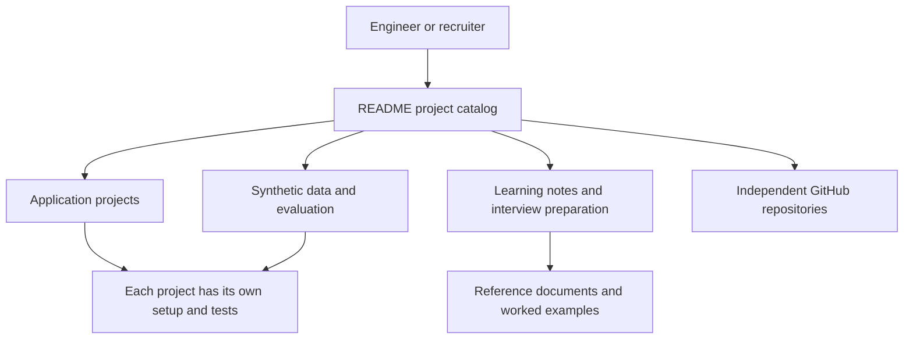

# upSkilling — project architecture

[README](README.md) · [Interview questions and answers](INTERVIEW_QA.md)

## Purpose and repository boundary

This repository is a portfolio index and collection of learning projects. Its folders are independent exercises or applications; they do not form one shared backend or deployment. Many completed projects have moved to separate GitHub repositories, as recorded in [.gitignore](.gitignore) and the README portfolio map.

## Portfolio architecture

The arrows show navigation and project ownership, rather than network traffic. Each application’s own architecture document defines its runtime.

## Main components

| Component | Responsibility |
| --- | --- |
| [`github-pages/index.html`](github-pages/index.html) | Portfolio landing page |
| [`README.md`](README.md) | Recruiter navigation and project catalog |
| [`docs/README.md`](docs/README.md) | Portfolio reference notes |
| [`kaggle-mlops-datasets/README.md`](kaggle-mlops-datasets/README.md) | Synthetic data generation and evaluation inputs |
| [`pyMlSystem/README.md`](pyMlSystem/README.md) | Incident operations application |
| [`ai-mock-interviewer/README.md`](ai-mock-interviewer/README.md) | Mock interview application |
| [`linkedin-branding-and-content/README.md`](linkedin-branding-and-content/README.md) | Content and learning workflows |
| [`.gitignore`](.gitignore) | Independent repositories and generated files excluded from this portfolio |

## Automation boundaries

GitHub Actions workflows select their own project paths and working directories. A workflow for one folder does not verify every other project. Review these definitions before attributing a test or deployment result to the entire portfolio:

- [`.github/workflows/instagram-reel-daily.yml`](.github/workflows/instagram-reel-daily.yml).
- [`.github/workflows/linkedin-daily.yml`](.github/workflows/linkedin-daily.yml).
- [`.github/workflows/portfolio-ci.yml`](.github/workflows/portfolio-ci.yml).
- [`.github/workflows/pymlsystem-ci.yml`](.github/workflows/pymlsystem-ci.yml).
- [`.github/workflows/run-pipeline.yml`](.github/workflows/run-pipeline.yml).
- [`.github/workflows/web-resume-pages.yml`](.github/workflows/web-resume-pages.yml).
- [`.github/workflows/youtube-short-daily.yml`](.github/workflows/youtube-short-daily.yml).

## Local walkthrough

1. Choose a project from the README portfolio map.
2. Determine whether its code lives here or in an independent repository.
3. Follow that project’s dependency manifests and setup commands.
4. Run that project’s tests or evaluation fixtures.
5. Read its architecture, decision boundaries, and handoff notes.

There is no single install or start command for all projects in this portfolio. Python, Node, and infrastructure tools belong to the projects that declare them.

## FDE presentation and handoff

Use the portfolio as an evidence index: start with a customer problem, open the relevant discovery and design files, demonstrate a concrete workflow, and show its test or evaluation result. Cloud, SRE, and MLOps projects support the deployment half of the story; FDE engagements support discovery, judgment, and communication.

## Interview preparation

[INTERVIEW_QA.md](INTERVIEW_QA.md) explains the repository boundary, reproducibility, project selection, and how to present the portfolio in an FDE interview.
