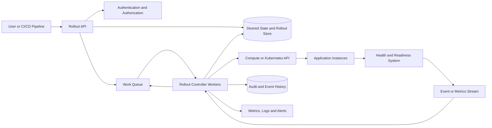
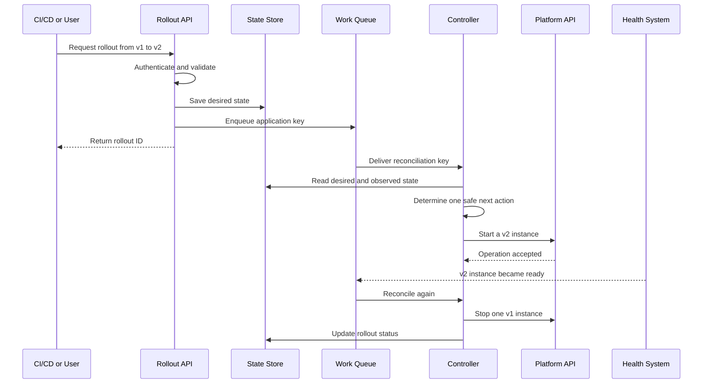
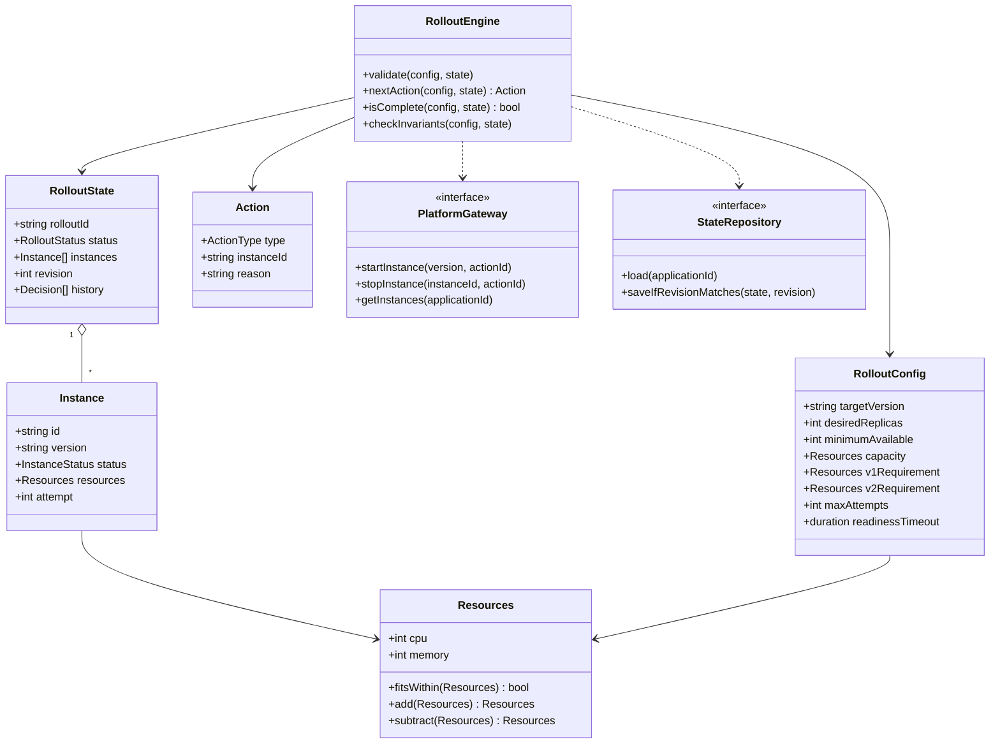
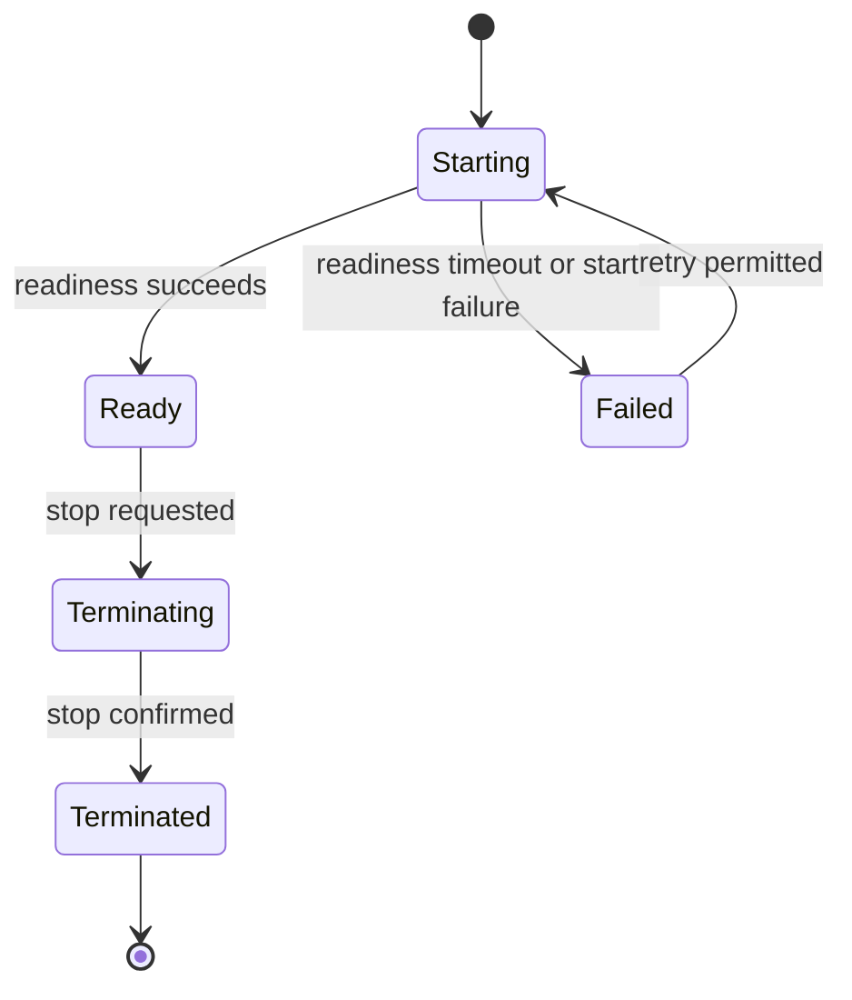
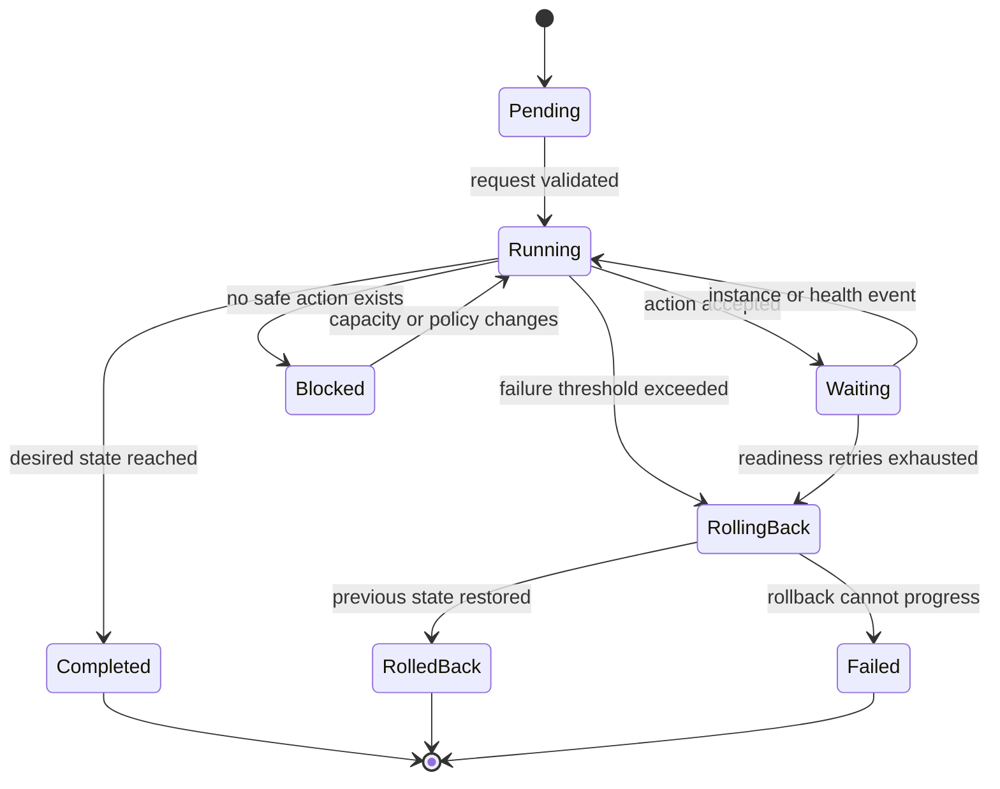
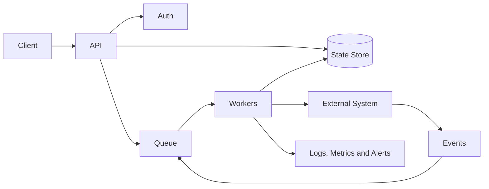
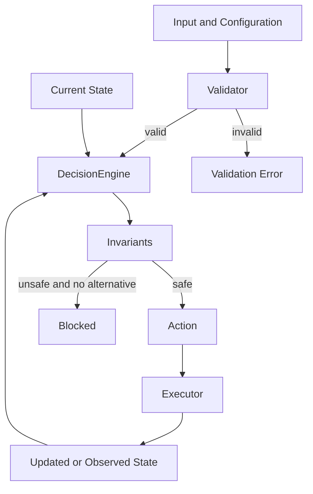

# 40-Day DevOps/SRE Problem-Solving Learning Plan

This plan prepares you for DevOps/SRE machine-coding questions involving
schedulers, resource allocation, health checks, retries, rate limiting, circuit
breakers, Kubernetes reconciliation, rolling deployments, and rollbacks.

The objective is not to finish as many courses as possible. The objective is to
be able to:

1. Convert an ambiguous requirement into a precise model.
2. Identify state, constraints, and safe actions.
3. Implement readable and testable logic.
4. Handle failures and edge cases.
5. explain the solution confidently during an interview.

Use the companion question bank:

- [DevOps and SRE Machine-Coding Exercises](./DEVOPS_SRE_MACHINE_CODING_EXERCISES.md)

---

## Minimal-Cost Learning Resources

### Primary Udemy Course

#### Kubernetes for the Absolute Beginners — Hands-on

- Instructor: Mumshad Mannambeth and KodeKloud Training
- Link: <https://www.udemy.com/course/learn-kubernetes/>
- Use it for: Pods, ReplicaSets, Deployments, Services, resources, health
  checks, and rolling updates.
- When to use it: Days 13–19 of this plan.

Buy it only during a normal Udemy sale. Do not wait for the course before
starting Days 1–12.

### Optional Udemy Course

#### SOLID Principles: Introducing Software Architecture & Design

- Instructor: George Sonora
- Link: <https://www.udemy.com/course/solid-design/>
- Use it for: maintainable code, separation of responsibilities, extensibility,
  and refactoring.
- When to use it: only after the interview, or selectively during Days 8–12 if
  extra time is available.

This course is optional because hands-on problem solving is more important
during the next 40 days.

### Free Programming Practice

#### Exercism

- Link: <https://exercism.org/>
- Choose: JavaScript track
- Use it for: functions, arrays, maps, classes, error handling, and testing.
- Cost: free

Use JavaScript during this plan because the existing AI Mock Interviewer
project already uses Node.js. Do not switch programming languages during the
40-day preparation period unless the interview explicitly requires another
language.

### Free SRE Material

#### Google SRE Books

- Link: <https://sre.google/books/>
- Start with: *The Site Reliability Workbook*
- Focus on: SLOs, error budgets, monitoring, incident response, canary
  deployments, and overload.
- Cost: free to read online

Do not read the books from beginning to end during this plan. Read only the
sections connected to the current exercise.

### Free Kubernetes Material

#### Kubernetes Concepts

- Link: <https://kubernetes.io/docs/concepts/>
- Focus on: workloads, Deployments, Jobs, probes, resources, controllers, and
  scheduling.

#### Kubernetes Controller Pattern

- Link: <https://kubernetes.io/docs/concepts/architecture/controller/>
- Learn this central loop:

```text
Observe current state
Compare it with desired state
Choose a safe action
Apply the action
Observe again
```

#### Killercoda

- Link: <https://killercoda.com/>
- Use it for: free browser-based Kubernetes practice.
- Cost: free tier

#### KodeKloud Free Courses and Labs

- Courses: <https://kodekloud.com/free-courses>
- Kubernetes labs: <https://kodekloud.com/studio/labs/kubernetes?lang=en>
- Cost: selected resources are free

### Resources to Use After the Interview

#### CKAD with Tests

- Link: <https://www.udemy.com/course/certified-kubernetes-application-developer/>
- Use after the interview for deeper Kubernetes application knowledge.

#### Go Programming

- Link: <https://www.udemy.com/course/learn-how-to-code/>
- Use after the interview before learning Kubebuilder and production
  Kubernetes controller development.

#### Kubebuilder

- Link: <https://github.com/kubernetes-sigs/kubebuilder>
- Use after learning Go and Kubernetes fundamentals.

Do not add CKAD, Go, or Kubebuilder to the current 40-day workload unless the
job description specifically requires them.

---

## Problem-Solving Framework

Complete this worksheet before writing code for every exercise.

```text
1. What are the inputs?
2. What output is expected?
3. What state changes over time?
4. What must never become false?
5. Which actions are possible?
6. When is each action permitted?
7. What is the successful final state?
8. When is the system blocked or failed?
9. Which edge cases should be tested?
```

The conditions that must never become false are the safety invariants.

Examples:

```text
runningJobs <= availableWorkers
usedResources <= totalResources
healthyInstances >= minimumAvailable
instanceCount >= 0
```

For state-machine questions, create a transition table:

| Current state | Event | Condition | Action | Next state |
|---|---|---|---|---|
| Healthy | Check failed | Three consecutive failures | Alert | Unhealthy |
| Unhealthy | Check passed | Two consecutive successes | Recover | Healthy |

---

## Daily Schedule

### Two-Hour Version

```text
30 minutes — learn one relevant concept
60 minutes — design or implement one exercise
20 minutes — test edge cases
10 minutes — explain the solution aloud
```

### Three-Hour Version

```text
45 minutes — learn
90 minutes — design or implement
30 minutes — test and refactor
15 minutes — explain and record lessons
```

Rules:

- Do not watch more than 30–45 minutes of video without practising.
- Do not look at a solution before completing your own first attempt.
- Keep one page of notes for each exercise.
- Record the time spent and the main mistake discovered.
- Stop after the daily task instead of purchasing or starting another course.

---

# The 40-Day Plan

## Phase 1 — Model Problems Before Coding

### Day 1: Limited-Worker Job Scheduler

Design only; do not code.

- Model five jobs and two workers.
- Define waiting, running, and completed jobs.
- Manually simulate every state change.
- Prove that the worker limit is never exceeded.

Deliverable: completed problem-solving worksheet and transition table.

### Day 2: Resource Allocator

Design only.

- Model nodes with finite CPU and memory.
- Decide when a workload can be placed.
- Define rejection and waiting behaviour.
- Include duplicate workload IDs.

Deliverable: manual allocation walkthrough for at least five workloads.

### Day 3: Service Health Monitor

Design only.

- Mark a service unhealthy after three consecutive failures.
- Mark it healthy after two consecutive successes.
- Decide how to handle stale and duplicate results.

Deliverable: state diagram and at least six test scenarios.

### Day 4: Retry Engine

Design only.

- Define retryable and permanent errors.
- Set maximum attempts and delay rules.
- Define success, exhausted, and cancelled states.

Deliverable: attempt timeline for success, permanent failure, and exhaustion.

### Day 5: Deployment Configuration Validator

Design only.

- Validate replicas, images, resources, probes, and environment variables.
- Return all validation errors.
- Separate development and production rules.

Deliverable: validation rules and invalid-input examples.

### Day 6: Review and Explain

- Review Days 1–5.
- Explain each solution aloud without notes.
- Identify common ideas: state, actions, invariants, and terminal conditions.

Deliverable: one-page summary of the reusable patterns.

---

## Phase 2 — Implement the Foundations

### Day 7: Implement the Worker Scheduler

- Use JavaScript.
- Separate state from scheduling decisions.
- Add tests for zero workers, duplicate IDs, and more jobs than workers.

### Day 8: Implement the Resource Allocator

- Track CPU and memory separately.
- Support allocation and release.
- Test exact capacity and insufficient capacity.

### Day 9: Implement the Health Monitor

- Use explicit states.
- Emit an event only when state changes.
- Test alternating successes and failures.

### Day 10: Implement the Retry Engine

- Separate retry policy from operation execution.
- Test immediate success, eventual success, permanent error, and exhaustion.

### Day 11: Implement a Token-Bucket Rate Limiter

- Track clients independently.
- Define refill behaviour.
- Test empty, partial, and full buckets.

### Day 12: Implement a Basic Circuit Breaker

- Use `CLOSED`, `OPEN`, and `HALF_OPEN`.
- Test every permitted transition.
- Explain why calls are rejected while open.

Checkpoint:

- Can you define inputs, state, invariants, and transitions without assistance?
- Can you write tests before seeing a reference solution?
- Can you explain why every state change is safe?

If the answer is no, repeat Days 9–12 before moving forward.

---

## Phase 3 — Kubernetes Foundations

Use the Kubernetes beginner course, official documentation, and free labs.

### Day 13: Kubernetes Architecture and Desired State

Learn:

- Control plane and worker nodes
- API server, scheduler, kubelet, and controllers
- Current state versus desired state

Practise: describe Kubernetes as a collection of reconciliation loops.

### Day 14: Pods and ReplicaSets

Learn:

- Pod lifecycle
- Pending, running, ready, failed, and terminating states
- How ReplicaSets maintain replica count

Practise: manually reconcile desired replicas of three from different current
states.

### Day 15: Deployments and Rolling Updates

Learn:

- Deployments and ReplicaSets
- Rolling update strategy
- `maxSurge` and `maxUnavailable`

Practise: manually simulate an update from three `v1` replicas to three `v2`
replicas.

### Day 16: Readiness and Liveness

Learn:

- Difference between running and ready
- Readiness, liveness, and startup probes
- Why a new instance cannot immediately count as available

Practise: add health transitions to the rolling-update simulation.

### Day 17: Resource Requests, Limits, and Scheduling

Learn:

- CPU and memory requests
- Resource limits
- Basic placement and insufficient-capacity behaviour

Practise: place workloads manually on three nodes.

### Day 18: Jobs, Failures, and Retries

Learn:

- Jobs and CronJobs
- Restart and backoff behaviour
- Terminal and retryable failure

Practise: compare Kubernetes Job behaviour with the retry engine.

### Day 19: Rollbacks and Troubleshooting

Learn:

- Rollout status and history
- Rollbacks
- Common Pending and unready conditions

Practise in Killercoda or a free KodeKloud lab.

---

## Phase 4 — DevOps/SRE Machine Coding

### Day 20: Rolling-Update Design

Design only.

- Define `v1`, starting `v2`, healthy `v2`, and resources.
- Define minimum available capacity.
- Determine valid next actions.
- Define blocked rollout conditions.

### Day 21: Rolling-Update Implementation

- Implement one deterministic next action at a time.
- Validate invariants after every transition.
- Test successful, exact-capacity, and blocked rollouts.

### Day 22: Canary Deployment

- Design and implement canary size, observation window, success criteria, and
  rollback.
- Handle missing and duplicate metrics.

### Day 23: Dependency-Aware Job Scheduler

- Validate the dependency graph.
- Detect cycles.
- Run independent jobs within a worker limit.
- Block dependants after prerequisite failure.

### Day 24: Error-Budget Tracker

- Read only the relevant SLO/error-budget material from the Google SRE books.
- Handle duplicate and out-of-order measurements.
- Define warning and exhausted states.

### Day 25: Incident Escalation Engine

- Model created, acknowledged, resolved, and escalated states.
- Prevent duplicate notifications.
- Test timer events after acknowledgement.

### Day 26: Automatic Deployment Rollback

- Store the previous stable state.
- Define rollback triggers.
- Maintain availability during rollback.
- Define failure when rollback itself becomes blocked.

Checkpoint:

- Can you solve a new state-machine problem within two hours?
- Do you test duplicate, stale, invalid, and failure events?
- Can you recognize a blocked state without looping forever?

---

## Phase 5 — Kubernetes Controller Thinking

The goal is to understand controller behaviour, not to master Go or
Kubebuilder.

### Day 27: Replica Reconciliation Controller

- Compare desired and current replicas.
- Perform at most one external action per reconciliation.
- Return whether another reconciliation is needed.
- Make repeated reconciliation safe.

### Day 28: Idempotency

Study and practise:

- Repeating the same request safely
- Stable resource identifiers
- Create-if-missing and update-if-different
- Avoiding duplicate side effects

Add idempotency tests to the Day 27 controller.

### Day 29: Dependency-Aware Controller

- Reconcile a database, secret, network policy, and application.
- Create dependencies in deterministic order.
- Propagate dependency status.

### Day 30: Finalizer Cleanup

- Model deletion request, cleanup, retry, and finalizer removal.
- Handle missing external resources safely.
- Define permanent-failure and manual-intervention behaviour.

### Day 31: Stale and Duplicate Events

Update an earlier solution to handle:

- Events received twice
- Events received out of order
- Events for deleted resources
- Reconciliation after process restart

### Day 32: Zone-Aware Rolling Update

- Maintain global and per-zone availability.
- Avoid updating every instance in one zone simultaneously.
- Continue safely after a failed replacement.

---

## Phase 6 — Timed Interview Practice

For Days 33–37, use this 90-minute format:

```text
10 minutes — clarify requirements and state assumptions
15 minutes — design state, invariants, and actions
45 minutes — implement
15 minutes — test
5 minutes  — summarize trade-offs and improvements
```

### Day 33: Timed Job Scheduler

Use a new variation with priorities or multiple tenants.

### Day 34: Timed Rate Limiter

Use a sliding-window or hierarchical variation.

### Day 35: Timed Circuit Breaker

Use a rolling failure window and minimum sample size.

### Day 36: Timed Rolling Update

Include different resource requirements for `v1` and `v2`.

### Day 37: Timed Rollback Controller

Include failed health checks and a rollback that may itself become blocked.

After every timed exercise, record:

```text
Where did I lose time?
Which requirement did I misunderstand?
Which edge case did I miss?
Was my explanation clear?
What will I do differently tomorrow?
```

---

## Phase 7 — Mock Interviews and Revision

### Day 38: Full Coding Mock

- 10 minutes of clarification
- 15 minutes of design
- 45 minutes of implementation
- 15 minutes of tests
- 15 minutes of discussion and follow-up changes

Record the session if possible.

### Day 39: DevOps/SRE and Kubernetes Mock

Include:

- One rolling deployment scenario
- One Kubernetes troubleshooting scenario
- One SLO/error-budget question
- One incident-response scenario
- Two behavioural questions answered using STAR

### Day 40: Light Revision

Do not learn anything new.

Review:

- The six strongest implementations
- Common invariants
- State-machine transitions
- Kubernetes Deployments, probes, resources, and controllers
- Retry, rate limiting, circuit breaking, and rollback
- Five production stories from personal experience

Finish early and rest.

---

## Weekly Progress Tracker

| Checkpoint | Target | Completed |
|---|---|---|
| Day 6 | Five problems designed and explained | [ ] |
| Day 12 | Six foundational problems implemented and tested | [ ] |
| Day 19 | Kubernetes deployment foundations completed | [ ] |
| Day 26 | Seven DevOps/SRE simulations completed | [ ] |
| Day 32 | Controller and reconciliation exercises completed | [ ] |
| Day 37 | Five timed exercises completed | [ ] |
| Day 40 | Two mock interviews and final revision completed | [ ] |

---

## Interview Communication Template

Use this sequence while solving:

```text
1. "Let me clarify a few requirements."
2. "I will state my assumptions."
3. "The state I need to track is..."
4. "These conditions must always remain true..."
5. "The possible actions are..."
6. "Before an action, I will check..."
7. "The rollout/simulation completes when..."
8. "It is blocked or failed when..."
9. "I will test the normal flow and these edge cases..."
```

Do not remain silent while coding. Explain important decisions, but avoid
narrating every line.

---

## Final Self-Review Checklist

Before declaring an exercise complete, verify:

- [ ] Inputs are validated.
- [ ] State is explicit.
- [ ] Safety invariants are written down.
- [ ] Preconditions are checked before actions.
- [ ] Completion is clearly defined.
- [ ] Blocked and failure states are clearly defined.
- [ ] The algorithm cannot loop forever without progress.
- [ ] Duplicate and stale events are considered.
- [ ] External actions can be retried safely.
- [ ] Tests cover normal, boundary, invalid, and failure cases.
- [ ] Names communicate intent.
- [ ] Decision-making logic is separate from side effects.
- [ ] The solution can be explained in five minutes.

## What Not to Do During These 40 Days

- Do not purchase several courses.
- Do not switch among JavaScript, Python, Java, and Go.
- Do not spend entire days watching videos.
- Do not copy solutions before making a complete attempt.
- Do not attempt advanced Kubebuilder development prematurely.
- Do not solve only easy happy-path examples.
- Do not ignore tests and explanation practice.

The central habit for all 40 days is:

```text
Clarify → Model state → Define invariants → Choose a safe action
→ Handle failure → Test → Explain
```

---

# Interview-Point Alignment

Interviewers may use different scorecards, but a strong machine-coding answer is
usually evaluated across the following areas. Use this 100-point rubric to
review every timed exercise and mock interview.

## Suggested 100-Point Scorecard

| Evaluation area | Points | What the interviewer looks for |
|---|---:|---|
| Requirement clarification | 10 | Relevant questions, explicit assumptions, ambiguity detection |
| State and API modelling | 15 | Clear inputs, outputs, entities, state, and interfaces |
| Correctness and progress | 20 | Valid transitions, correct result, termination, no infinite loop |
| Safety constraints | 15 | Resources and availability checked before every action |
| Failure and edge cases | 15 | Invalid input, blocked state, failures, retries, stale/duplicate events |
| Code quality and maintainability | 10 | Readable names, small functions, separation of concerns |
| Testing and verification | 10 | Happy path, boundary, failure, and invariant tests |
| Communication and trade-offs | 5 | Clear explanation, alternatives, production improvements |
| **Total** | **100** | |

## Score Interpretation

```text
85–100: Strong interview-ready solution
70–84:  Good solution, but some important gaps remain
55–69:  Partial solution; improve modelling, edge cases, or testing
Below 55: Revisit fundamentals before increasing problem difficulty
```

A working program alone is not automatically a strong interview solution. A
candidate can lose significant points by failing to clarify requirements,
protect invariants, test boundaries, or explain failure behaviour.

---

## 1. Requirement Clarification — 10 Points

Before designing, clarify details that materially change the solution.

For a rolling update, ask:

- Are resources measured as instance count, CPU/memory, or both?
- Does a newly started instance count as available immediately or only after a
  readiness check?
- Can `v1` and `v2` consume different resources?
- Is the desired replica count allowed to differ from the current count?
- What should happen if a `v2` instance fails to become healthy?
- Should the engine return one next action or a complete plan?
- What does rule 3 mean if its wording is ambiguous?

Do not ask questions whose answers do not affect the design. If the interviewer
does not provide an answer, state a reasonable assumption and continue.

Full-credit behaviour:

```text
"I will assume a new instance consumes resources immediately but contributes
to available capacity only after it becomes ready. If no safe action can make
progress, the rollout returns BLOCKED with a reason."
```

Common point losses:

- Starting implementation immediately
- Silently inventing important behaviour
- Asking many low-value questions
- Remaining blocked because every detail was not specified

---

## 2. State and API Modelling — 15 Points

Define:

- Configuration that does not change during the rollout
- Runtime state that changes after events
- Actions returned by the engine
- Status returned to the caller

Example model:

```text
Configuration:
- desiredReplicas
- minimumAvailable
- totalResources
- v1ResourceRequirement
- v2ResourceRequirement

Runtime state:
- healthyV1
- startingV2
- healthyV2
- failedV2
- resourcesUsed

Possible decisions:
- START_V2
- WAIT
- STOP_V1
- RETRY
- COMPLETE
- BLOCKED
```

Full-credit behaviour:

- State names have one clear meaning.
- Configuration and mutable state are separated.
- Inputs and outputs are easy to test.
- Invalid or impossible states are rejected.

Common point losses:

- Using unrelated global variables
- Treating running and ready as the same state
- Mixing decision logic with external execution
- Failing to define the expected result

---

## 3. Correctness and Progress — 20 Points

The algorithm must move toward the desired state and terminate.

For every action, explain:

```text
Precondition: When is this action legal?
Transition:   How does it change the state?
Progress:     How does it move closer to completion?
Postcondition:Which invariants remain true afterward?
```

Full-credit behaviour:

- Produces a correct rollout for valid inputs.
- Does not skip required state transitions.
- Never creates negative counts.
- Detects completion exactly.
- Detects when no action can make progress.
- Cannot loop forever while returning the same state.

Common point losses:

- Returning `WAIT` forever with no event or timeout
- Removing old capacity before replacement capacity is ready
- Over-creating the new version
- Forgetting to remove remaining old instances
- Having multiple actions accidentally mutate the same state

---

## 4. Safety Constraints — 15 Points

State invariants explicitly and check them before or after every transition.

Rolling-update invariants:

```text
resourcesUsed <= totalResources
healthyV1 + healthyV2 >= minimumAvailable
healthyV1 >= 0
healthyV2 >= 0
startingV2 >= 0
healthyV2 + startingV2 <= desiredReplicas
```

Full-credit behaviour:

- Resource checks happen before starting an instance.
- Availability checks happen before stopping an instance.
- Only ready instances contribute to available capacity.
- The invariants are covered by tests.

Common point losses:

- Checking capacity only at the start of the rollout
- Counting pending instances as healthy
- Checking one resource while ignoring another
- Assuming an action is safe because the final state is safe

---

## 5. Failures and Edge Cases — 15 Points

At minimum, discuss and test:

- Already-completed rollout
- Exact resource capacity
- Insufficient spare resources
- Minimum availability equal to current availability
- `v2` using more resources than `v1`
- New instance failing readiness
- Invalid or negative inputs
- Duplicate health events
- Stale health events
- Repeated execution of the same action

Full-credit behaviour:

- Distinguishes `BLOCKED` from `FAILED`.
- Provides a useful reason.
- Defines retry limits or timeout behaviour.
- Does not corrupt state after duplicate events.
- Mentions rollback when appropriate.

Useful distinction:

```text
BLOCKED:
The current valid state has no safe action, such as insufficient capacity.

FAILED:
An attempted operation or health check failed and retry policy was exhausted.
```

---

## 6. Code Quality and Maintainability — 10 Points

Even when time is limited:

- Use names that describe intent.
- Keep validation, decision-making, and state mutation separate.
- Prefer small functions with one responsibility.
- Avoid deeply nested conditions.
- Avoid premature design patterns and abstractions.
- Make decisions deterministic for the same input.

An effective structure is:

```text
validateConfiguration(...)
validateState(...)
determineNextAction(...)
applyAction(...)
checkInvariants(...)
isComplete(...)
```

Common point losses:

- One large function containing every responsibility
- Magic numbers
- Repeated conditions
- Mutating input unexpectedly
- Clever code that is difficult to explain
- Designing a large framework before completing the core algorithm

---

## 7. Testing and Verification — 10 Points

Tests should prove both outcomes and safety.

Minimum test groups:

```text
Happy path:
- Rollout completes with spare capacity.

Boundary:
- Resource capacity is exactly enough.
- Availability is exactly at the minimum.

Blocked:
- Cannot start v2 and cannot stop v1 safely.

Failure:
- v2 never becomes healthy.

Validation:
- Negative counts or inconsistent state.

Invariant:
- Every intermediate state respects resources and availability.
```

Full-credit behaviour:

- Tests transitions, not only the final result.
- Includes named scenarios that communicate intent.
- Covers failure and boundary cases.
- Checks that invalid actions do not mutate state.

---

## 8. Communication and Trade-offs — 5 Points

While solving:

- Explain the model before implementation.
- Announce important assumptions.
- Explain why an action is safe.
- Mention complexity only after correctness.
- Respond to interviewer changes calmly.
- Distinguish the exercise model from a production system.

Useful production follow-ups:

- Persisting rollout state
- Handling concurrent controllers
- Optimistic locking/version checks
- Metrics and audit logs
- Cancellation and rollback
- Readiness timeouts
- Idempotent infrastructure APIs
- Multiple availability zones

Do not attempt to implement all production follow-ups unless asked. Mention
them as deliberate extensions.

---

## Interview Evaluation Sheet

Copy this table after every timed exercise:

| Area | Maximum | My score | Evidence or gap |
|---|---:|---:|---|
| Requirement clarification | 10 |  |  |
| State and API modelling | 15 |  |  |
| Correctness and progress | 20 |  |  |
| Safety constraints | 15 |  |  |
| Failures and edge cases | 15 |  |  |
| Code quality | 10 |  |  |
| Testing | 10 |  |  |
| Communication | 5 |  |  |
| **Total** | **100** |  |  |

After scoring, select only the lowest two areas for improvement during the next
exercise.

---

## 40-Day Interview Score Targets

| Checkpoint | Target score | Primary expectation |
|---|---:|---|
| Day 6 | 50+ design-only | Identify state, actions, and constraints |
| Day 12 | 60+ | Complete basic implementations with tests |
| Day 19 | 65+ | Explain Kubernetes rollout behaviour |
| Day 26 | 70+ | Handle blocked and failure states |
| Day 32 | 75+ | Understand reconciliation and idempotency |
| Day 37 | 80+ under time limit | Complete and explain a timed solution |
| Day 40 | 85+ | Interview-ready performance |

These scores measure preparation, not personal ability. A low score identifies
the next skill to practise.

---

## Rolling-Update Interview Checklist

Before finishing the rolling-update exercise, confirm:

- [ ] Ambiguous requirements were clarified.
- [ ] Resource and readiness assumptions were stated.
- [ ] Current and desired state were modelled.
- [ ] Running and ready instances were distinguished.
- [ ] Resource invariants were defined.
- [ ] Availability invariants were defined.
- [ ] Every action has a precondition.
- [ ] Completion is detected.
- [ ] A blocked rollout is detected.
- [ ] Failed readiness has defined behaviour.
- [ ] Intermediate states are tested.
- [ ] The design is deterministic and maintainable.
- [ ] Production extensions and trade-offs can be explained.

---

# How to Build and Draw HLD and LLD

HLD and LLD answer different questions:

| Design level | Main question | What to show |
|---|---|---|
| HLD | Which major components exist and how do they communicate? | Users, services, databases, queues, external systems, data flow, deployment boundaries |
| LLD | How does one component behave internally? | Classes/modules, interfaces, fields, methods, state transitions, algorithms, validation and errors |

For a machine-coding exercise, begin with a compact LLD. Discuss HLD only when
the interviewer asks how the simulator or controller would operate in
production.

## HLD Thinking Framework

Use this sequence:

```text
1. Functional requirements
2. Non-functional requirements
3. Scale assumptions
4. External APIs
5. Major components
6. Data flow
7. Data storage
8. Reliability and failure handling
9. Security and observability
10. Trade-offs and bottlenecks
```

### Functional Requirements

Describe what the system must do.

For a rollout controller:

- Accept a desired application version and replica count.
- Observe the current deployment state.
- Select safe rollout actions.
- Start and stop instances.
- Evaluate instance readiness.
- Report progress, completion, failure, or blocked status.
- Support cancellation or rollback.

### Non-Functional Requirements

Describe the qualities the system must preserve:

- Availability
- Resource safety
- Correctness
- Idempotency
- Fault tolerance
- Auditability
- Low control-loop latency
- Horizontal scalability
- Security

### Scale Assumptions

State approximate scale before selecting infrastructure:

```text
10,000 applications
100,000 instances
1,000 rollout events per second
One active rollout per application
Status retained for 90 days
```

The exact numbers matter less than explaining how the design changes as scale
increases.

---

## Rolling-Update Controller HLD Example



### Component Responsibilities

| Component | Responsibility |
|---|---|
| Rollout API | Validate and accept rollout requests |
| Desired-state store | Persist version, replica count, policy and status |
| Work queue | Deliver reconciliation work and absorb event bursts |
| Controller workers | Compare desired and current state and select safe actions |
| Platform adapter | Start, stop and inspect instances |
| Health system | Provide readiness and failure signals |
| Audit store | Preserve decisions and operator-visible history |
| Observability | Expose rollout latency, failures, blocked states and retries |

### HLD Request Flow



### HLD Decisions to Discuss

- Why use a reconciliation loop instead of one long synchronous request?
- How is only one controller allowed to modify an application at a time?
- What is persisted so that a controller restart is safe?
- How are duplicate queue deliveries handled?
- How are stale health events rejected?
- How are provider API rate limits handled?
- What metrics identify a stuck rollout?
- How is rollback initiated?

Possible answers include idempotent actions, application-level ownership or
leases, optimistic version checks, persisted status, retry backoff, event
versions, and dead-letter/manual-intervention paths.

---

## LLD Thinking Framework

Use this order:

```text
1. Identify domain objects.
2. Separate configuration from mutable state.
3. Define interfaces at external boundaries.
4. Define actions and statuses.
5. Write invariants.
6. Draw the state machine.
7. Write the next-action algorithm.
8. Define errors.
9. Design tests.
```

### Suggested LLD Modules



This diagram is illustrative. During a 60–90 minute interview, draw only the
classes or modules necessary to explain the core design.

### Instance State Machine



### Rollout State Machine



### Core Interfaces

Keep pure decision-making separate from side effects:

```text
RolloutEngine.nextAction(config, observedState) -> Action
PlatformGateway.execute(action) -> OperationResult
StateRepository.save(state, expectedRevision) -> SaveResult
HealthProvider.getStatus(instanceId) -> HealthStatus
```

Benefits:

- The algorithm can be unit tested without Kubernetes or cloud APIs.
- Platform-specific code stays behind an adapter.
- Retrying an action can use a stable action ID.
- Concurrent writes can be detected with a revision.

---

## LLD Algorithm Walkthrough

The next-action logic can be explained without writing language-specific code:

```text
1. Validate configuration and observed state.
2. Check all invariants.
3. If the desired state exists, return COMPLETE.
4. If a v2 instance is starting, return WAIT with a deadline.
5. If another v2 can start within resource limits, return START_V2.
6. If a healthy v1 can stop without violating availability, return STOP_V1.
7. If a failed v2 can retry within policy, return RETRY_V2.
8. Otherwise return BLOCKED with a reason.
```

The exact order depends on the assumptions. State the chosen policy and explain
why it preserves safety and makes progress.

---

## How to Draw HLD During an Interview

Use approximately 20–25 minutes:

### Minutes 0–5: Requirements

- Clarify the users, functional requirements, constraints, and scale.
- State what is out of scope.

### Minutes 5–10: API and Data Model

- Define the main rollout request and status response.
- Identify desired state, observed state, and rollout history.

### Minutes 10–15: Components and Data Flow

- Draw clients on the left.
- Draw the API and control components in the centre.
- Draw databases, queues, and external platforms on the right or bottom.
- Add arrows only for important communication paths.

### Minutes 15–20: Deep Dive

- Choose one important component, normally the reconciliation controller.
- Explain concurrency, idempotency, failure handling, and persistence.

### Minutes 20–25: Reliability and Trade-offs

- Discuss controller crashes, duplicate events, stale state, retries,
  observability, security, and scaling.

Do not begin by drawing databases and queues without first establishing the
requirements that justify them.

---

## How to Draw LLD During an Interview

Use approximately 15–20 minutes before implementation:

### Minutes 0–5: Objects and State

- Identify configuration, mutable state, value objects, and actions.
- Avoid creating a class for every noun.

### Minutes 5–10: Interfaces and Transitions

- Define the rollout engine interface.
- Define external adapters.
- Draw the important state machine.

### Minutes 10–15: Algorithm and Invariants

- Write decision order.
- Place preconditions beside actions.
- Explain completion, blocked, and failure states.

### Minutes 15–20: Tests and Extensions

- List normal, boundary, blocked, and failure tests.
- Mention production extensions without implementing all of them.

---

## Reusable HLD Diagram Template

Use this skeleton for scheduler, rate limiter, health monitor, circuit breaker,
or deployment controller questions:



Remove components that are not justified. For example, an in-process rate
limiter may not require a queue, workers, or persistent database.

## Reusable LLD Diagram Template



---

## HLD/LLD Practice Plan Within the 40 Days

Add the following drawing work without increasing study time significantly:

| Days | Drawing practice |
|---|---|
| 1–6 | Draw state and transition diagrams only |
| 7–12 | Draw modules/functions and their responsibilities |
| 13–19 | Draw Kubernetes architecture and Deployment reconciliation |
| 20–26 | Draw LLD before every implementation |
| 27–32 | Draw controller HLD plus reconciliation sequence diagrams |
| 33–37 | Spend no more than 15 minutes on LLD in timed exercises |
| 38–39 | Include one complete HLD and one complete LLD mock |
| 40 | Review existing diagrams; draw nothing new |

## HLD/LLD Scoring Rubric

| Area | Points |
|---|---:|
| Requirements and scope | 10 |
| Appropriate component boundaries | 15 |
| Correct data flow | 10 |
| Data model and state | 10 |
| API/interface design | 10 |
| Reliability and failure handling | 15 |
| Scalability and concurrency | 10 |
| Security and observability | 5 |
| Trade-offs and alternatives | 10 |
| Diagram clarity and communication | 5 |
| **Total** | **100** |

For a ₹25 LPA interview at seven years of experience, target:

```text
HLD: Explain the production architecture, reliability, scale, and trade-offs.
LLD: Produce implementable modules, transitions, invariants, and tests.
```

The interviewer should be able to look at the HLD and understand how the
production system works. A developer should be able to look at the LLD and
begin implementing the core behaviour.
