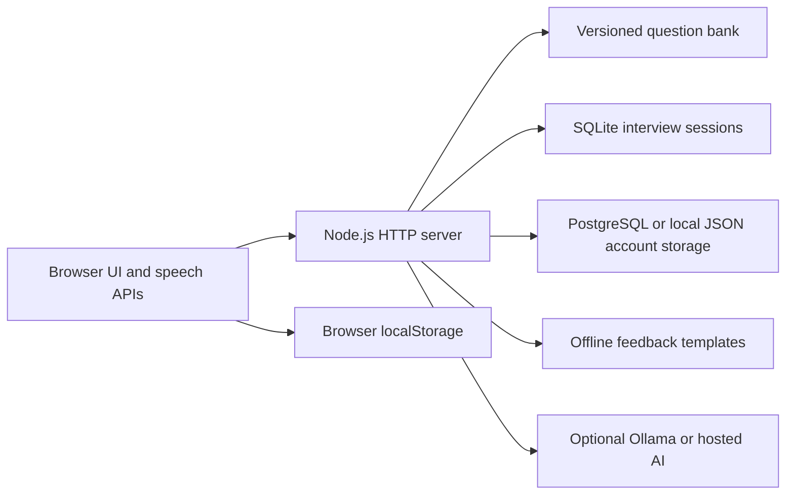

# Case study: AI Mock Interviewer

**A local-first technical interview practice tool with optional AI feedback.**

Repository: https://github.com/iarsingh/ai-mock-interviewer

## The problem

Technical interview preparation is often spread across question lists, notes, job descriptions, and separate AI chats. This project brings those activities into a repeatable practice workflow: choose a topic, answer a question, review feedback, and continue practicing.

The intended audience is engineers preparing for DevOps, SRE, Cloud, Platform Engineering, and MLOps interviews. This is a learning and portfolio project; it is not an assessment of employability or a validated hiring tool.

## A representative use case

An engineer preparing for an SRE interview wants to practice Kubernetes troubleshooting:

1. Start the application locally in offline mode and create a local account.
2. Choose the relevant topic or a prepared mock interview set.
3. Read the question or use browser speech output.
4. Type an answer, or use speech recognition where the browser supports it.
5. Compare the response with practice material and feedback.
6. Continue the session and revisit preparation topics.

For a job-specific session, the engineer can paste or upload a job description. Optional provider configuration enables local Ollama or hosted AI feedback. The baseline typed-answer flow does not require an API key.

## What is implemented

- A canonical, deduplicated bank of **9,576 questions and answers** at the reviewed revision, with topic/type metadata and synchronized public data.
- Topic practice, structured preparation plans, and mock interview sets.
- Typed and browser-assisted voice interaction.
- Job-description practice with PDF, DOCX, and OCR parsing support.
- Offline template feedback and optional AI providers.
- Account flows, saved Skills Dashboard interviews, and browser-stored practice state.
- A companion Chrome extension for job-application assistance.
- Automated checks for interview persistence, answer ownership, question-bank consistency, and tracked-file hygiene.

Counts and automated answer checks describe repository contents, not independently validated answer accuracy. No user-adoption, interview-success, or time-savings claims are made.

## Architecture



The frontend uses HTML, CSS, and JavaScript. The backend uses Node's HTTP module. PostgreSQL can persist account/contact data; SQLite separately stores Skills Dashboard interviews. These storage paths should not be described as one fully managed database.

## Engineering decisions and tradeoffs

| Decision | Benefit | Tradeoff |
| --- | --- | --- |
| Local-first offline mode | The core workflow can be tried without an AI subscription | Template feedback has limited nuance |
| Optional providers | Users choose local inference or a hosted service | Hosted use sends relevant inputs outside the machine and may cost money |
| Browser speech APIs | No dedicated speech backend needed for supported browsers | Browser support varies; recognition can require network access |
| Canonical question bank | Generated/public exports can be checked for consistency | Content still needs provenance review and technical maintenance |
| Lightweight Node server | Straightforward local setup and inspectable request flow | Hosted operation needs deployment-specific security and capacity validation |

## Three-minute demonstration

1. **Context:** explain the fragmented preparation problem and the local-first goal.
2. **Practice:** choose a technical topic and submit a short typed answer using synthetic material.
3. **Feedback:** show the resulting practice feedback and explain the difference between templates and model-generated feedback.
4. **Personalization:** show job-description input with a fictional job description.
5. **Engineering:** show the question-bank checks, storage boundaries, and one automated persistence/ownership test.

Use synthetic accounts and answers in recordings. Keep private profiles, tokens, and real job-application documents out of screenshots.

## Run it

Use Node.js 22 as specified in `.nvmrc`:

```sh
git clone https://github.com/iarsingh/ai-mock-interviewer.git
cd ai-mock-interviewer
npm ci
cp .env.example .env
npm run start:offline
```

Open http://127.0.0.1:3030. See the [README](../README.md) for account setup, environment configuration, and platform-specific instructions.

## Known boundaries

- This is an interview-practice project, not a production SaaS claim.
- Browser voice recognition is not guaranteed to work offline.
- Some state is browser-local; account/contact persistence and interview-session persistence are separate.
- Vercel's temporary SQLite storage does not provide durable shared interview history.
- Generated feedback and reference answers can be wrong and should be checked against authoritative technical documentation.
- Third-party and user-contributed questions require redistribution permission; the code license does not establish rights to every source.

## Why this is relevant to an FDE portfolio

The project demonstrates turning a concrete user workflow into a usable tool, supporting multiple integration modes, handling offline fallbacks, making storage tradeoffs explicit, and maintaining reusable content through automated checks. A stronger next step is a small pilot with consenting users and measured feedback on usefulness, correctness, and friction.

Future work could include a documented evaluation set for feedback quality, clearer per-feature data retention, deployment-specific hardening, and usability findings from real practice sessions.
