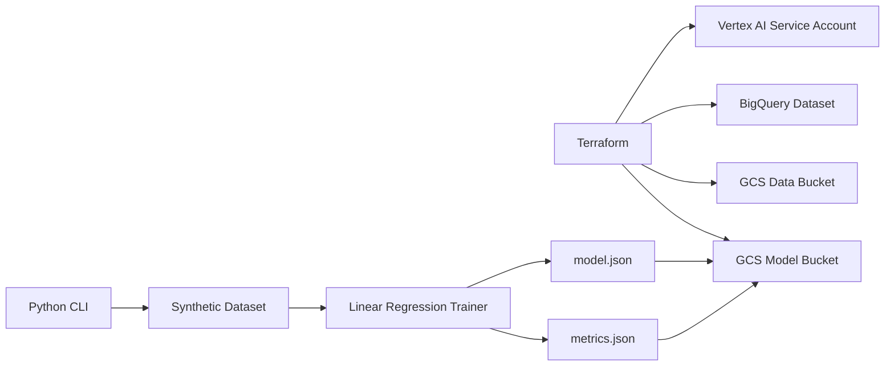

# GCP Vertex Tabular ML Project

A practical machine learning project for Google Cloud Platform. It trains a
small tabular regression model locally, writes reproducible artifacts, and
provisions the GCP foundation needed to move the workflow into Vertex AI.

## What This Project Builds

Terraform provisions:

- A GCS bucket for datasets
- A GCS bucket for model artifacts
- A BigQuery dataset for feature tables
- A Vertex AI pipeline service account
- IAM permissions for Storage, BigQuery, and Vertex AI execution

Python provides:

- Synthetic house price dataset generation
- A dependency-light linear regression trainer
- Metrics and model artifact output
- Optional artifact upload to GCS
- A CLI that works locally and can be used by a Vertex AI custom job

## Architecture



## Project Layout

```text
.
├── README.md
├── pyproject.toml
├── requirements.txt
├── src/gcp_vertex_tabular_ml/
│   ├── cli.py
│   ├── config.py
│   ├── data.py
│   ├── gcs.py
│   ├── model.py
│   └── pipeline.py
├── terraform/
│   ├── main.tf
│   ├── outputs.tf
│   └── variables.tf
└── tests/
```

## Prerequisites

- Python 3.10+
- Terraform 1.0+
- Google Cloud SDK
- A GCP project with billing enabled
- Application Default Credentials configured

Authenticate:

```bash
gcloud auth login
gcloud auth application-default login
gcloud config set project YOUR_PROJECT_ID
```

## Local Setup

```bash
cd gcp-cloud-engineering-portfolio/gcp_vertex_tabular_ml
python3 -m venv .venv
source .venv/bin/activate
pip install -r requirements.txt
pip install -e .
```

Run tests:

```bash
python -m pytest
```

## Train Locally

```bash
python -m gcp_vertex_tabular_ml.cli train \
  --project-id YOUR_PROJECT_ID \
  --region us-central1 \
  --rows 1000
```

This writes:

```text
data/housing.csv
artifacts/model.json
artifacts/metrics.json
```

## Deploy GCP Infrastructure

```bash
export PROJECT_ID="your-gcp-project-id"
export REGION="us-central1"

terraform -chdir=terraform init
terraform -chdir=terraform plan \
  -var="project_id=${PROJECT_ID}" \
  -var="region=${REGION}"
terraform -chdir=terraform apply \
  -var="project_id=${PROJECT_ID}" \
  -var="region=${REGION}"
```

## Upload Model Artifacts

```bash
MODEL_BUCKET="$(terraform -chdir=terraform output -raw model_bucket)"

python -m gcp_vertex_tabular_ml.cli upload-artifacts \
  --bucket "${MODEL_BUCKET}" \
  --artifact-dir artifacts \
  --prefix models/house-price
```

## Vertex AI Custom Job Path

After publishing this package into a container image, use the same command as
the container entrypoint:

```bash
python -m gcp_vertex_tabular_ml.cli train \
  --project-id YOUR_PROJECT_ID \
  --region us-central1 \
  --rows 5000
```

The Terraform output `vertex_service_account_email` is the service account to
use for a Vertex AI custom training job.

