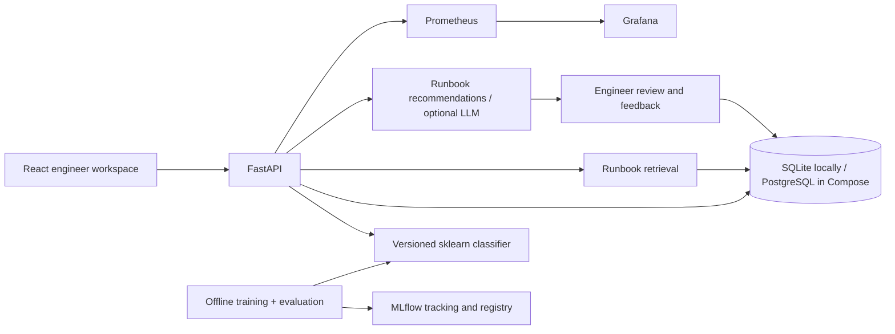

# Architecture and FDE learning roadmap

## Customer problem

An operations team needs a consistent first investigation step when an alert arrives. The pilot workflow accepts an incident manually, suggests an owning team, surfaces runbook evidence, and lets the engineer record whether it helped. It does not execute remediation, contact teams, or claim the root cause is known.

Pilot success should be measured against the team's current process: routing accuracy, useful recommendation rate, median time to first actionable step, and missed critical incidents. The demo has no real-user time-savings evidence. Collect a baseline before assigning improvement targets.

## Boundaries and tradeoffs

- SQLite makes the project usable without Docker. PostgreSQL and pgvector use the same SQLAlchemy models and an explicit migration. PostgreSQL retrieval ranks vectors in the database; SQLite scans the tiny demo corpus.
- Lexical hashing avoids downloads/API calls. Evaluate real semantic embeddings against lexical retrieval before adopting them. Keep embedding version and dimensions with a production corpus; rebuild vectors when changing models.
- Five categories and five runbooks keep the flow inspectable. Synthetic evaluation examples are distinct from training, but still generated from the same narrow vocabulary. Perfect demo scores do not imply generalization.
- Models load once per API process. Readiness fails if the model checksum is invalid, the database is unavailable, or runbooks are missing. Training and migrations are separate commands.
- The checksum detects accidental corruption, not malicious replacement of both model and manifest. Joblib artifacts must come from a trusted build/training pipeline.
- A shared API key supports an initial private deployment; it does not implement user identity, tenant isolation, RBAC, or audit-grade accountability. The local UI keeps a supplied key only in memory.
- No incident content is placed in metric labels. Paths are templated to avoid unbounded cardinality. Trace export is optional; confirm attribute filtering before handling real customer data.

## Next increments

1. **Customer discovery:** interview an on-call engineer, map the current workflow, and gather approved de-identified examples. Write acceptance criteria with the customer.
2. **Data and evaluation:** replace synthetic data; split by incident/service/time to avoid leakage; report per-class metrics, low-confidence coverage, retrieval recall@k, and groundedness. Add feedback-based offline evaluation rather than automatically retraining on every correction.
3. **Integrations:** implement one authenticated alert webhook and one ticketing connector with idempotency keys, retries, and a bounded job queue. Demonstrate partial failure handling.
4. **Identity and scale:** OIDC, tenant-scoped records, role checks, rate limits, request-size limits at ingress, PII/secret handling, and audit logs. Load-test latency and queue behavior.
5. **Model releases:** immutable registry/artifact version, candidate approval, signature verification, shadow/canary comparisons, and rollback of both code and model.
6. **Cloud:** complete the deployment checklist in `cloud-deployment.md`; add CI federation and image publishing only when a cloud project is chosen.

For an interview demo, show a known Kubernetes incident, a low-confidence unknown incident, a saved correction, an MLflow run, and a dashboard. Explain why the system asks for review and how you would validate it with a real customer.
