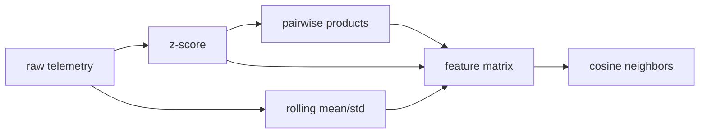

# Lab 01 — NumPy feature engine

[Project architecture](../PROJECT_ARCHITECTURE.md) · [Interview Q&A](../INTERVIEW_QA.md)

Build a feature matrix from synthetic service telemetry without pandas.

## Goal

Turn latency, error rate, CPU, and memory into leakage-safe features using only vectorized NumPy.

## What it does

- Generates a synthetic `(n, 4)` telemetry array.
- Z-scores each column.
- Computes rolling mean and std with a sliding window so row `t` never uses `t+1`.
- Adds pairwise column products through broadcasting.
- Finds nearest neighbors with cosine similarity.
- Writes `artifacts/numpy_report.json` (warmup rows dropped, feature names, neighbor scores).



## Run

```sh
cd python-ml-framework-labs
python -m ml_labs numpy
```

## Interview talking points

- Why a rolling window must drop warmup rows instead of peeking forward.
- When broadcasting beats Python loops on feature crosses.
- Why cosine on z-scored vectors is a cheap baseline before a learned model.
- How you would version this feature code with the training set hash in lab 03.
