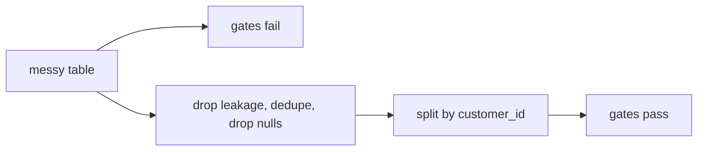

# Lab 02 — data-science quality gates

[Project architecture](../PROJECT_ARCHITECTURE.md) · [Interview Q&A](../INTERVIEW_QA.md)

Catch bad training data before a model is fit.

## Goal

A synthetic customer table is planted with duplicate IDs, missing charges, a future-looking `future_spend` column, and a row shuffle that leaks the same customer into train and test. Gates must fail. After cleaning, they must pass.

## What it does

- Null-rate, duplicate-ID, leakage-name/correlation, and train/test ID-overlap checks.
- Drops leakage columns, de-duplicates by `customer_id`, drops incomplete rows.
- Splits by customer ID, not by row.
- Writes `artifacts/quality_report.json` with before/after gate results.



## Run

```sh
cd python-ml-framework-labs
python -m ml_labs quality
```

## Interview talking points

- Row-wise splits are wrong when the unit of prediction is a customer.
- A high-correlation column named `future_*` is a leakage smell even if the model looks accurate.
- Quality gates belong in CI, not in a notebook that someone ran once.
- Cleaning is explicit and reversible; it does not impute a target.
