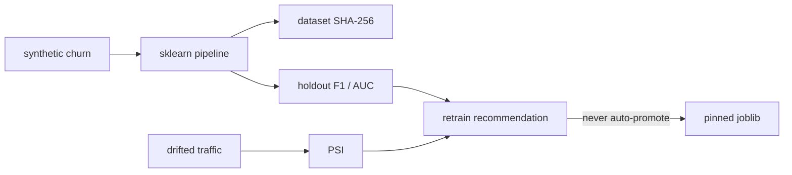

# Lab 03 — MLOps training and drift monitor

[Project architecture](../PROJECT_ARCHITECTURE.md) · [Interview Q&A](../INTERVIEW_QA.md)

Train a small churn classifier, persist hashed artifacts, and decide whether live traffic deserves a retrain review.

## Goal

Show the MLOps loop without claiming a production platform: sklearn pipeline, holdout metrics, dataset SHA-256, Population Stability Index, and a retrain *recommendation*.

## What it does

- Fits `StandardScaler` + one-hot + logistic regression on synthetic churn.
- Reports precision, recall, F1, ROC-AUC, and confusion counts. Accuracy is not the headline metric.
- Writes `artifacts/churn_model.joblib` and `artifacts/metrics.json`.
- Scores PSI on numeric features against drifted traffic.
- Flags retrain when PSI ≥ 0.2 or live F1 drops. It does not deploy a new model.
- Exposes per-feature logistic contributions for the serving lab.



## Run

```sh
cd python-ml-framework-labs
python -m ml_labs train
```

## Interview talking points

- PSI is a distribution alarm, not proof of concept drift.
- A score should start an investigation: data quality, label delay, then a candidate model.
- The serving process should pin a checksummed artifact, not a mutable “latest” alias.
- Auto-retrain without an evaluation gate is how silent regressions ship.
