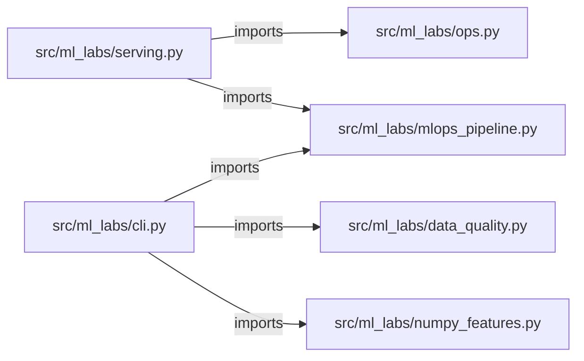

# python-ml-framework-labs — project architecture

[README](README.md) · [Interview questions and answers](INTERVIEW_QA.md)

## Purpose and scope

Four local labs: a NumPy feature engine, data-science quality gates, an MLOps train/monitor loop, and a FastAPI serving service. All tables are generated in process. This is not a production system and not a customer deployment.

## Component diagram

Arrows show local imports, not network calls.

## Components and responsibilities

| Component | Responsibility |
| --- | --- |
| [`src/ml_labs/numpy_features.py`](src/ml_labs/numpy_features.py) | Causal rolling stats, z-scores, pairwise products, cosine neighbors |
| [`src/ml_labs/data_quality.py`](src/ml_labs/data_quality.py) | Null, duplicate, leakage, and train/test ID-overlap gates |
| [`src/ml_labs/mlops_pipeline.py`](src/ml_labs/mlops_pipeline.py) | Train, hash artifacts, PSI drift, retrain recommendation, feature contributions |
| [`src/ml_labs/serving.py`](src/ml_labs/serving.py) | `GET /healthz`, `GET /readyz`, `GET /model`, `POST /predict`, `POST /predict/batch` |
| [`src/ml_labs/ops.py`](src/ml_labs/ops.py) | `/v1` workspaces and jobs; production approve returns 403 |
| [`src/ml_labs/cli.py`](src/ml_labs/cli.py) | `python -m ml_labs {numpy,quality,train,serve}` |
| [`Dockerfile`](Dockerfile) | Non-root image for the FastAPI lab |
| [`docker-compose.yml`](docker-compose.yml) | Loopback publish on port 8080 |
| [`tests/`](tests) | Executable checks |
| [`docs/ARCHITECTURE.md`](docs/ARCHITECTURE.md) | Endpoint and operating notes |

## Request interface

| Method and path | Handler | Source |
| --- | --- | --- |
| `GET /healthz` | `healthz` | [`serving.py`](src/ml_labs/serving.py) |
| `GET /readyz` | `readyz` | [`serving.py`](src/ml_labs/serving.py) |
| `GET /model` | `get_model` | [`serving.py`](src/ml_labs/serving.py) |
| `POST /predict` | `predict` | [`src/ml_labs/serving.py`](src/ml_labs/serving.py) |
| `POST /predict/batch` | `predict_batch` | [`src/ml_labs/serving.py`](src/ml_labs/serving.py) |
| `POST /v1/jobs/{job_id}/approve` | `approve_job` | [`src/ml_labs/ops.py`](src/ml_labs/ops.py) |

## Operating boundaries

A PSI spike or F1 drop recommends investigation. The lab never auto-promotes a model. `prod` job approval is refused. Kubernetes YAML is a sketch; this repository does not apply it.
